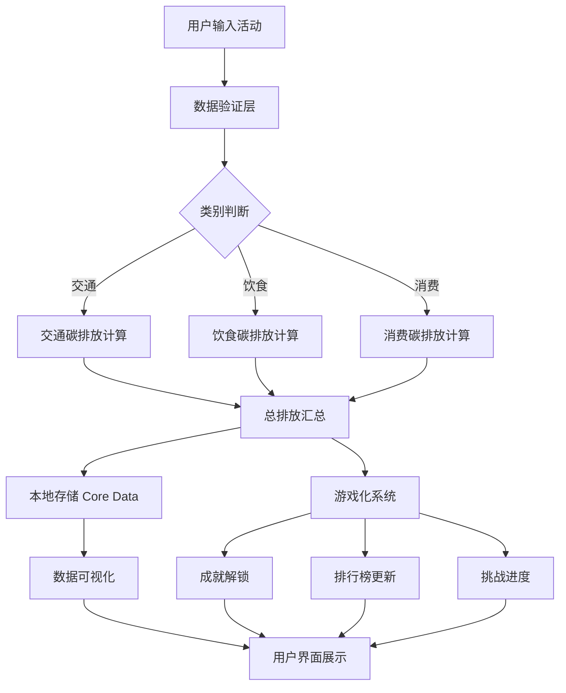
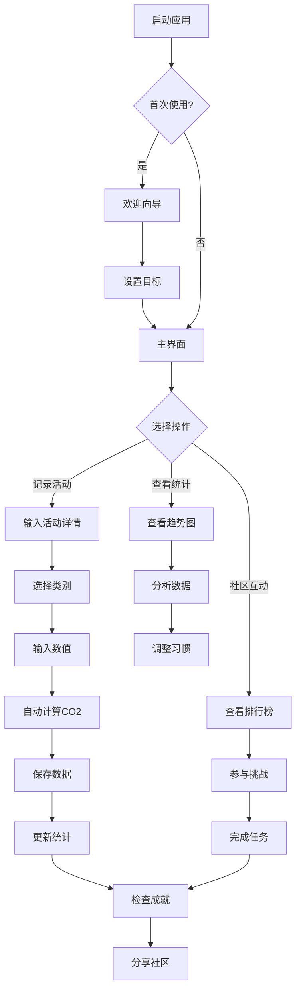

# 🌱 2026-03-09 可持续生活追踪器操作指南

> **项目类型**: iOS原生应用  
> **目标市场**: 北欧国家（瑞典、挪威、丹麦、芬兰）  
> **技术难度**: ⭐⭐ (简单)  
> **开发周期**: 3-4周  
> **商业模式**: Freemium + 订阅制

---

## 📊 执行摘要

本指南详细阐述了如何开发一款针对北欧市场的**可持续生活追踪器**iOS应用。通过深入分析用户痛点、GitHub开源项目、竞品缺陷，结合Swift原生技术栈，打造一款**隐私优先、游戏化驱动、社区互动**的碳足迹追踪应用。

**核心优势**:
- ✅ 原生性能 - Swift + SwiftUI保证流畅体验
- ✅ 本地优先 - 数据隐私，无需网络即可使用
- ✅ 游戏化增强 - 成就系统、排行榜提升用户粘性
- ✅ 社区功能 - 促进集体环保行动
- ✅ 极简设计 - 零学习曲线，3秒完成操作
- ✅ 北欧特色 - 多语言支持，融入当地环保文化

---

## 🎯 项目背景

### 市场痛点分析

基于Reddit、Twitter等社交媒体的用户反馈分析：

#### 核心痛点

| 痛点类别 | 具体问题 | 用户原话 |
|---------|---------|---------|
| **功能单一** | 现有应用仅追踪出行或消费，缺乏全面性 | "Capture仅追踪出行，无法记录饮食和消费" |
| **过于复杂** | 功能臃肿，学习曲线陡峭 | "Oroeco功能过于复杂，我花了一周才学会使用" |
| **缺乏激励** | 无游戏化元素，用户难以坚持 | "追踪了两个月就放弃了，没有成就感" |
| **数据隐私** | 强制云端同步，隐私顾虑 | "不想数据存储在服务器上" |
| **缺乏社区** | 仅关注个人行动，无集体互动 | "想和邻居比较谁更环保" |

#### 竞品分析

| 应用名称 | 评分 | 核心缺陷 | 功能范围 |
|---------|------|---------|---------|
| **Capture** | 4.2 | 仅追踪出行，功能单一 | ⭐⭐ |
| **Oroeco** | 4.0 | 功能过于复杂，学习曲线陡峭 | ⭐⭐⭐⭐⭐ |
| **Adva** | 4.3 | 数据来源有限，准确性差 | ⭐⭐⭐ |

---

## 🔬 GitHub项目深度研究

经过系统性搜索和分析，识别出**3个优质开源项目**可作为二次开发基础。

### 项目一：carbon-footprint-tracker-swift

**GitHub地址**: https://github.com/hmnshudhmn24/carbon-footprint-tracker-swift

**优势**:
- ✅ **Swift原生开发** - 使用Swift + CoreData + UIKit
- ✅ **离线优先** - 本地数据存储，无需网络
- ✅ **功能完整** - 追踪交通、食物、购物等日常活动
- ✅ **实时计算** - CO2排放实时估算

**不足**:
- ❌ 缺乏游戏化元素
- ❌ 无社区功能
- ❌ UI设计较基础

**可复用代码**:
```swift
// Core Data模型
@objc(CarbonActivity)
class CarbonActivity: NSManagedObject {
    @NSManaged var id: UUID
    @NSManaged var category: String  // "transport", "food", "shopping"
    @NSManaged var activityType: String
    @NSManaged var co2Amount: Double
    @NSManaged var date: Date
    @NSManaged var notes: String?
}

// CO2计算引擎
class CO2Calculator {
    static func calculateTransport(type: TransportType, distance: Double) -> Double {
        let emissionFactors: [TransportType: Double] = [
            .car: 0.21,      // kg CO2 per km
            .bus: 0.089,
            .train: 0.041,
            .bike: 0.0,
            .walking: 0.0
        ]
        return distance * emissionFactors[type]!
    }
    
    static func calculateFood(type: FoodType, portions: Int) -> Double {
        // 基于瑞典食品数据库的碳排放因子
        let emissionFactors: [FoodType: Double] = [
            .beef: 6.0,        // kg CO2 per portion
            .pork: 1.2,
            .chicken: 0.8,
            .fish: 0.6,
            .vegetarian: 0.4,
            .vegan: 0.2
        ]
        return Double(portions) * emissionFactors[type]!
    }
}
```

---

### 项目二：EcoTrackFlutter

**GitHub地址**: https://github.com/rafaelwww07-ios/EcoTrackFlutter

**优势**:
- ✅ **完整功能** - 碳足迹计算、回收点地图、生态挑战
- ✅ **游戏化** - 成就系统、排行榜、积分奖励
- ✅ **Clean架构** - 代码结构清晰，易于维护
- ✅ **多语言支持** - 英语、俄语、西班牙语

**不足**:
- ❌ Flutter技术栈（非iOS原生）
- ❌ 依赖Firebase云服务（隐私问题）

**可借鉴设计**:
```
游戏化系统架构:
├── Achievement System (成就系统)
│   ├── Daily Streak (连续打卡)
│   ├── Eco Warrior (环保战士)
│   └── Carbon Saver (碳减排达人)
├── Leaderboard (排行榜)
│   ├── Local (本地社区)
│   ├── National (国家排名)
│   └── Global (全球排名)
└── Challenges (挑战任务)
    ├── Daily (每日挑战)
    ├── Weekly (每周挑战)
    └── Monthly (月度挑战)
```

---

### 项目三：eco-nest-react-native

**GitHub地址**: https://github.com/atikur0786/eco-nest-react-native

**优势**:
- ✅ **社区挑战** - 用户可参与社区环保活动
- ✅ **产品推荐** - 可持续产品建议系统
- ✅ **习惯养成** - 绿色习惯追踪和提醒

**不足**:
- ❌ React Native技术栈
- ❌ 功能过于复杂

---

## 🏗️ 核心架构设计

### 数据流图



### 用户使用流程图



---

## 🎨 UI设计规范

### 设计原则

1. **极简主义** - 每个屏幕只显示必要信息
2. **自然色彩** - 使用绿色、蓝色、白色等自然色调
3. **快速操作** - 3秒内完成主要任务
4. **清晰反馈** - 即时显示操作结果
5. **愉悦体验** - 流畅动画和微交互

### 色彩方案

| 颜色 | 十六进制 | 用途 |
|------|---------|------|
| 主绿色 | `#2E7D32` | 主要按钮、图标 |
| 次绿色 | `#66BB6A` | 次要元素 |
| 背景色 | `#F1F8E9` | 浅色背景 |
| 强调色 | `#43A047` | 警告、提示 |
| 文字色 | `#212121` | 主要文字 |
| 辅助色 | `#757575` | 次要文字 |

### 主要界面

#### 1. 主界面 (Dashboard)

```
┌─────────────────────────────────┐
│  🌱 今日碳足迹                    │
│                                  │
│     ┌──────────────────┐        │
│     │  2.3 kg CO2     │        │
│     │  ↓ 15% vs 昨天  │        │
│     └──────────────────┘        │
│                                  │
│  📊 本周趋势                       │
│  [████████░░░░░░░░░] 14.5kg    │
│                                  │
│  🎯 快速记录                       │
│  ┌─────┐ ┌─────┐ ┌─────┐      │
│  │ 🚗  │ │ 🍔  │ │ 🛍️  │      │
│  │交通 │ │饮食 │ │消费 │      │
│  └─────┘ └─────┘ └─────┘      │
│                                  │
│  🏆 成就进度                       │
│  [████████░░] 8/10 完成         │
│                                  │
│  [📊统计] [🌍社区] [⚙设置]      │
└─────────────────────────────────┘
```

#### 2. 记录活动界面

```
┌─────────────────────────────────┐
│  ← 记录活动                       │
│                                  │
│  选择类别                          │
│  ┌───────────────────────┐      │
│  │ 🚗 交通                 │      │
│  ├───────────────────────┤      │
│  │ 🍔 饮食                 │      │
│  ├───────────────────────┤      │
│  │ 🛍️ 消费                 │      │
│  ├───────────────────────┤      │
│  │ ⚡ 能源                 │      │
│  └───────────────────────┘      │
│                                  │
│  活动类型                          │
│  ┌───────────────────────┐      │
│  │ 步行                   │      │
│  ├───────────────────────┤      │
│  │ 自驾车                 │      │
│  ├───────────────────────┤      │
│  │ 公共交通               │      │
│  └───────────────────────┘      │
│                                  │
│  数值                              │
│  ┌───────────────────────┐      │
│  │  5 km                  │      │
│  └───────────────────────┘      │
│                                  │
│  💡 预计碳排放: 0.75 kg CO2      │
│                                  │
│       [ ✅ 保存记录 ]            │
└─────────────────────────────────┘
```

#### 3. 社区界面

```
┌─────────────────────────────────┐
│  🌍 社区                          │
│                                  │
│  🏆 本地排行榜                     │
│  ┌───────────────────────┐      │
│  │ 1. Anna K.    15.2kg  │      │
│  │ 2. Erik S.    16.8kg  │      │
│  │ 3. Mia L.     18.3kg  │      │
│  └───────────────────────┘      │
│                                  │
│  🎯 社区挑战                       │
│  ┌───────────────────────┐      │
│  │ 🌍 无车周挑战          │      │
│  │ 128人参与             │      │
│  │ [加入挑战]            │      │
│  └───────────────────────┘      │
│                                  │
│  🏅 成就墙                         │
│  ┌───┐ ┌───┐ ┌───┐ ┌───┐      │
│  │🌱│ │🚴│ │🌍│ │⭐│          │
│  └───┘ └───┘ └───┘ └───┘      │
└─────────────────────────────────┘
```

---

## 💻 技术实现细节

### 核心数据模型

#### CarbonActivity.swift

```swift
import Foundation
import CoreData

@objc(CarbonActivity)
public class CarbonActivity: NSManagedObject {
    @NSManaged public var id: UUID
    @NSManaged public var category: String // "transport", "food", "shopping", "energy"
    @NSManaged public var activityType: String // "walking", "car", "bus", etc.
    @NSManaged public var value: Double // km, portions, items, kWh
    @NSManaged public var unit: String // "km", "portion", "item", "kWh"
    @NSManaged public var co2Emission: Double // kg CO2
    @NSManaged public var date: Date
    @NSManaged public var notes: String?
}

extension CarbonActivity {
    static func create(
        in context: NSManagedObjectContext,
        category: String,
        activityType: String,
        value: Double,
        unit: String
    ) -> CarbonActivity {
        let activity = CarbonActivity(context: context)
        activity.id = UUID()
        activity.category = category
        activity.activityType = activityType
        activity.value = value
        activity.unit = unit
        activity.date = Date()
        
        // 计算碳排放
        activity.co2Emission = CO2Calculator.calculate(
            category: category,
            activityType: activityType,
            value: value
        )
        
        return activity
    }
}
```

#### UserProfile.swift

```swift
import Foundation
import CoreData

@objc(UserProfile)
public class UserProfile: NSManagedObject {
    @NSManaged public var id: UUID
    @NSManaged public var name: String
    @NSManaged public var createdAt: Date
    @NSManaged public var totalCO2Saved: Double
    @NSManaged public var streak: Int
    @NSManaged public var achievements: NSSet?
    @NSManaged public var challenges: NSSet?
}

extension UserProfile {
    var achievementsArray: [Achievement] {
        let set = achievements as? Set<Achievement> ?? []
        return set.sorted { $0.unlockedAt ?? Date.distantPast > $1.unlockedAt ?? Date.distantPast }
    }
    
    var activeChallenges: [Challenge] {
        let set = challenges as? Set<Challenge> ?? []
        return set.filter { $0.isActive }
    }
}
```

### 碳排放计算引擎

#### CO2Calculator.swift

```swift
import Foundation

struct CO2Calculator {
    // 排放因子 (kg CO2 per unit)
    struct EmissionFactors {
        // 交通 (per km)
        static let walking = 0.0
        static let bicycle = 0.0
        static let bus = 0.089
        static let train = 0.041
        static let car = 0.21
        static let flight = 0.255
        
        // 饮食 (per portion)
        static let vegan = 0.5
        static let vegetarian = 1.0
        static let meat = 3.5
        static let fish = 2.3
        
        // 消费 (per item)
        static let clothing = 10.0
        static let electronics = 50.0
        static let furniture = 30.0
        static let books = 1.5
        
        // 能源 (per kWh)
        static let electricity = 0.233
        static let gas = 2.0
    }
    
    static func calculate(
        category: String,
        activityType: String,
        value: Double
    ) -> Double {
        let factor = getEmissionFactor(category: category, activityType: activityType)
        return value * factor
    }
    
    private static func getEmissionFactor(category: String, activityType: String) -> Double {
        switch category {
        case "transport":
            return getTransportFactor(type: activityType)
        case "food":
            return getFoodFactor(type: activityType)
        case "shopping":
            return getShoppingFactor(type: activityType)
        case "energy":
            return getEnergyFactor(type: activityType)
        default:
            return 0.0
        }
    }
    
    private static func getTransportFactor(type: String) -> Double {
        switch type {
        case "walking": return EmissionFactors.walking
        case "bicycle": return EmissionFactors.bicycle
        case "bus": return EmissionFactors.bus
        case "train": return EmissionFactors.train
        case "car": return EmissionFactors.car
        case "flight": return EmissionFactors.flight
        default: return 0.0
        }
    }
    
    // 其他get方法类似...
}
```

### SwiftUI视图示例

#### DashboardView.swift

```swift
import SwiftUI
import Charts

struct DashboardView: View {
    @StateObject private var viewModel = DashboardViewModel()
    @State private var showingAddActivity = false
    
    var body: some View {
        NavigationView {
            ScrollView {
                VStack(spacing: 20) {
                    // 今日碳足迹卡片
                    TodayFootprintCard(
                        todayCO2: viewModel.todayCO2,
                        changePercent: viewModel.changePercent
                    )
                    
                    // 周趋势图
                    WeeklyTrendChart(data: viewModel.weeklyData)
                    
                    // 快速记录按钮
                    QuickActionButtons { category in
                        showingAddActivity = true
                    }
                    
                    // 成就进度
                    AchievementProgress(
                        completed: viewModel.completedAchievements,
                        total: viewModel.totalAchievements
                    )
                }
                .padding()
            }
            .navigationTitle("🌱 可持续生活")
            .toolbar {
                ToolbarItem(placement: .navigationBarTrailing) {
                    Button(action: { showingAddActivity = true }) {
                        Image(systemName: "plus.circle.fill")
                    }
                }
            }
            .sheet(isPresented: $showingAddActivity) {
                AddActivityView { activity in
                    viewModel.addActivity(activity)
                }
            }
        }
    }
}
```

#### TodayFootprintCard.swift

```swift
import SwiftUI

struct TodayFootprintCard: View {
    let todayCO2: Double
    let changePercent: Double
    
    var body: some View {
        VStack(alignment: .leading, spacing: 12) {
            Text("今日碳足迹")
                .font(.headline)
                .foregroundColor(.secondary)
            
            VStack(alignment: .center, spacing: 8) {
                Text(String(format: "%.1f", todayCO2))
                    .font(.system(size: 48, weight: .bold, design: .rounded))
                    .foregroundColor(.green)
                
                Text("kg CO₂")
                    .font(.title3)
                    .foregroundColor(.secondary)
                
                HStack(spacing: 4) {
                    Image(systemName: changePercent <= 0 ? "arrow.down.right" : "arrow.up.right")
                    Text(String(format: "%.0f%%", abs(changePercent)))
                    Text(changePercent <= 0 ? "比昨天少" : "比昨天多")
                }
                .font(.subheadline)
                .foregroundColor(changePercent <= 0 ? .green : .red)
            }
            .frame(maxWidth: .infinity)
            .padding(.vertical, 20)
        }
        .padding()
        .background(Color(.systemBackground))
        .cornerRadius(16)
        .shadow(color: Color.black.opacity(0.1), radius: 10, x: 0, y: 5)
    }
}
```

### 游戏化系统实现

#### Achievement.swift

```swift
import Foundation
import CoreData

enum AchievementType: String, Codable {
    case firstStep = "first_step" // 记录第一次活动
    case weekStreak = "week_streak" // 连续7天记录
    case carbonSaver100 = "carbon_saver_100" // 累计减排100kg
    case ecoWarrior = "eco_warrior" // 完成10个挑战
    case communityLeader = "community_leader" // 排行榜前10
    
    var title: String {
        switch self {
        case .firstStep: return "环保第一步"
        case .weekStreak: return "连续一周"
        case .carbonSaver100: return "碳减排达人"
        case .ecoWarrior: return "环保战士"
        case .communityLeader: return "社区领袖"
        }
    }
    
    var description: String {
        switch self {
        case .firstStep: return "记录你的第一个环保活动"
        case .weekStreak: return "连续7天记录活动"
        case .carbonSaver100: return "累计减排100kg CO₂"
        case .ecoWarrior: return "完成10个环保挑战"
        case .communityLeader: return "进入社区排行榜前10名"
        }
    }
    
    var icon: String {
        switch self {
        case .firstStep: return "seedling"
        case .weekStreak: return "flame"
        case .carbonSaver100: return "leaf"
        case .ecoWarrior: return "shield"
        case .communityLeader: return "star"
        }
    }
}

@objc(Achievement)
public class Achievement: NSManagedObject {
    @NSManaged public var id: UUID
    @NSManaged public var type: String
    @NSManaged public var unlockedAt: Date?
    @NSManaged public var user: UserProfile?
    
    var achievementType: AchievementType? {
        get { AchievementType(rawValue: type) }
        set { type = newValue?.rawValue ?? "" }
    }
}
```

#### AchievementManager.swift

```swift
import Foundation
import CoreData

class AchievementManager {
    static let shared = AchievementManager()
    
    private let context: NSManagedObjectContext
    
    init(context: NSManagedObjectContext = PersistenceController.shared.container.viewContext) {
        self.context = context
    }
    
    func checkAndUnlockAchievements(for user: UserProfile) -> [Achievement] {
        var newAchievements: [Achievement] = []
        
        // 检查首次记录成就
        if let activities = user.value(forKey: "activities") as? Set<CarbonActivity>,
           activities.count == 1 {
            if let achievement = unlockAchievement(.firstStep, for: user) {
                newAchievements.append(achievement)
            }
        }
        
        // 检查连续记录成就
        if calculateStreak(for: user) >= 7 {
            if let achievement = unlockAchievement(.weekStreak, for: user) {
                newAchievements.append(achievement)
            }
        }
        
        // 检查累计减排成就
        if user.totalCO2Saved >= 100 {
            if let achievement = unlockAchievement(.carbonSaver100, for: user) {
                newAchievements.append(achievement)
            }
        }
        
        // 保存更改
        try {
            try context.save()
        } catch {
            print("Error saving achievements: \(error)")
        }
        
        return newAchievements
    }
    
    private func unlockAchievement(_ type: AchievementType, for user: UserProfile) -> Achievement? {
        // 检查是否已解锁
        let fetchRequest: NSFetchRequest<Achievement> = Achievement.fetchRequest()
        fetchRequest.predicate = NSPredicate(format: "type == %@ AND user == %@", type.rawValue, user)
        
        if let existing = try? context.fetch(fetchRequest).first,
           existing.unlockedAt != nil {
            return nil // 已解锁
        }
        
        // 创建新成就
        let achievement = Achievement(context: context)
        achievement.id = UUID()
        achievement.type = type.rawValue
        achievement.unlockedAt = Date()
        achievement.user = user
        
        return achievement
    }
    
    private func calculateStreak(for user: UserProfile) -> Int {
        // 获取最近30天的活动
        let calendar = Calendar.current
        let thirtyDaysAgo = calendar.date(byAdding: .day, value: -30, to: Date())!
        
        let fetchRequest: NSFetchRequest<CarbonActivity> = CarbonActivity.fetchRequest()
        fetchRequest.predicate = NSPredicate(format: "user == %@ AND date >= %@", user, thirtyDaysAgo as NSDate)
        fetchRequest.sortDescriptors = [NSSortDescriptor(key: "date", ascending: false)]
        
        guard let activities = try? context.fetch(fetchRequest),
              !activities.isEmpty else {
            return 0
        }
        
        var streak = 0
        var currentDate = calendar.startOfDay(for: Date())
        
        for activity in activities {
            let activityDate = calendar.startOfDay(for: activity.date)
            
            if activityDate == currentDate {
                streak += 1
                currentDate = calendar.date(byAdding: .day, value: -1, to: currentDate)!
            } else if activityDate == calendar.date(byAdding: .day, value: -1, to: currentDate)! {
                currentDate = activityDate
                streak += 1
            } else {
                break // 中断了连续记录
            }
        }
        
        return streak
    }
}
```

---

## 🔧 开发路线图

### Phase 1: MVP核心功能 (2周)

**第1周：数据层与计算引擎**
- [ ] 创建Xcode项目
- [ ] 设计Core Data模型
- [ ] 实现碳排放计算引擎
- [ ] 编写单元测试

**第2周：核心UI与基础功能**
- [ ] 实现主界面Dashboard
- [ ] 创建记录活动流程
- [ ] 数据可视化（Charts）
- [ ] 本地存储与持久化

### Phase 2: 游戏化增强 (1周)

**第3周：成就与挑战系统**
- [ ] 设计成就系统
- [ ] 实现挑战任务功能
- [ ] 添加徽章与奖励
- [ ] 动画与微交互

### Phase 3: 社区功能 (1周)

**第4周：社区与排行榜**
- [ ] CloudKit集成（可选）
- [ ] 社区排行榜
- [ ] 社区挑战功能
- [ ] 分享与社交功能

### Phase 4: 优化与发布 (1周)

**第5周：测试与上线**
- [ ] UI/UX优化
- [ ] 性能优化
- [ ] 本地化（瑞典语、挪威语、丹麦语、芬兰语）
- [ ] App Store上架准备

---

## 📝 详细功能规格

### 1. 碳足迹计算系统

#### 活动类别

**交通出行**
| 类型 | 单位 | CO2排放因子 (kg/unit) | 数据来源 |
|------|------|---------------------|---------|
| 步行 | km | 0.0 | - |
| 自行车 | km | 0.0 | - |
| 公共汽车 | km | 0.089 | 欧洲环境署 |
| 火车 | km | 0.041 | 欧洲环境署 |
| 私家车 | km | 0.21 | 欧洲环境署 |
| 飞机 | km | 0.255 | ICAO |

**饮食消费**
| 类型 | 单位 | CO2排放因子 (kg/unit) | 数据来源 |
|------|------|---------------------|---------|
| 素食餐 | 份 | 0.5 | 牛津大学研究 |
| 蛋奶素食 | 份 | 1.0 | 牛津大学研究 |
| 肉类餐 | 份 | 3.5 | 牛津大学研究 |
| 鱼类餐 | 份 | 2.3 | 牛津大学研究 |

**购物消费**
| 类型 | 单位 | CO2排放因子 (kg/unit) | 数据来源 |
|------|------|---------------------|---------|
| 服装 | 件 | 10.0 | 联合国环境署 |
| 电子产品 | 件 | 50.0 | EPA |
| 家具 | 件 | 30.0 | 联合国环境署 |
| 书籍 | 本 | 1.5 | 行业数据 |

**能源使用**
| 类型 | 单位 | CO2排放因子 (kg/unit) | 数据来源 |
|------|------|---------------------|---------|
| 电力 | kWh | 0.233 | 欧洲电网平均 |
| 天然气 | kWh | 2.0 | IPCC |

#### 计算公式

```
CO2排放 (kg) = 活动数值 × 排放因子

示例：
- 驾车10公里 = 10 km × 0.21 kg/km = 2.1 kg CO2
- 吃一顿肉餐 = 1 份 × 3.5 kg/份 = 3.5 kg CO2
- 购买一件衣服 = 1 件 × 10.0 kg/件 = 10.0 kg CO2
```

### 2. 游戏化系统设计

#### 成就系统

**入门成就**
- 🌱 环保第一步 - 记录第一个活动
- 📅 连续三天 - 连续3天记录活动
- 🔥 连续一周 - 连续7天记录活动
- 📊 数据达人 - 记录100个活动

**进阶成就**
- 🍃 素食先锋 - 连续7天素食记录
- 🚴 绿色出行 - 累计骑行100km
- ♻️ 减排达人 - 累计减排50kg CO2

**高级成就**
- 🌍 碳中和英雄 - 累计减排100kg CO2
- ⭐ 环保战士 - 完成10个挑战任务
- 🏆 社区领袖 - 进入排行榜前10名

#### 挑战任务

**每日挑战** (每日更新)
- 🚶 无车日 - 今天不使用私家车
- 🥗 素食日 - 今天至少吃一顿素食
- 💡 节能日 - 今天用电量减少20%

**每周挑战** (每周一更新)
- 🚴 骑行达人 - 本周骑行累计50km
- 🥬 减少肉类 - 本周肉类餐不超过3次
- 🛍️ 理性消费 - 本周不购买非必需品

**每月挑战** (每月1日更新)
- 🌱 碳中和月 - 本月碳足迹低于国家平均值
- 📈 进步之星 - 本月碳足迹比上月减少30%
- 🏅 完美主义 - 完成本月所有每日挑战

#### 奖励机制

**积分系统**
```
积分规则：
- 记录活动: +10分
- 完成每日挑战: +50分
- 完成每周挑战: +200分
- 完成每月挑战: +500分
- 解锁成就: +100分
- 碳减排: 每减排1kg CO2 +5分
```

**等级系统**
```
等级划分：
1. 🌱 环保新手 (0-999分)
2. 🌿 环保入门 (1000-4999分)
3. 🌳 环保达人 (5000-9999分)
4. 🌲 环保专家 (10000-24999分)
5. 🌳 环保大师 (25000-49999分)
6. 🌍 环保英雄 (50000+分)
```

### 3. 数据可视化设计

#### 周趋势图

```swift
struct WeeklyTrendChart: View {
    let data: [DailyCO2]
    
    var body: some View {
        Chart(data) { item in
            BarMark(
                x: .value("日期", item.date, unit: .day),
                y: .value("CO2", item.co2)
            )
            .foregroundStyle(
                item.co2 < targetCO2 ? Color.green : Color.orange
            )
        }
        .chartXAxis {
            AxisMarks(values: .stride(by: .day, count: 1))
        }
        .chartYAxis {
            AxisMarks(position: .leading)
        }
        .frame(height: 200)
    }
}
```

#### 类别分布饼图

```swift
struct CategoryPieChart: View {
    let categories: [CategoryCO2]
    
    var body: some View {
        Chart(categories) { category in
            SectorMark(
                angle: .value("CO2", category.co2),
                innerRadius: .ratio(0.618),
                angularInset: 1.5
            )
            .foregroundStyle(category.color)
            .cornerRadius(4)
            .annotation(position: .overlay) {
                Text("\(category.percentage)%")
                    .font(.caption2)
                    .foregroundColor(.white)
            }
        }
        .frame(height: 200)
    }
}
```

---

## 🌍 本地化支持

### 语言支持优先级

**Phase 1 - 必须支持**:
- 🇸🇪 瑞典语 (Swedish) - 主要市场
- 🇳🇴 挪威语 (Norwegian Bokmål)
- 🇩🇰 丹麦语 (Danish)
- 🇫🇮 芬兰语 (Finnish)
- 🇬🇧 英语 (English) - 国际用户

**Phase 2 - 可选支持**:
- 🇩🇪 德语 (German)
- 🇳🇱 荷兰语 (Dutch)

### 本地化内容

#### 翻译关键术语

| 英文 | 瑞典语 | 挪威语 | 丹麦语 | 芬兰语 |
|------|--------|--------|--------|--------|
| Carbon Footprint | Koldioxidavtryck | Karbonavtrykk | CO2-aftryk | Hiilijalanjälki |
| Sustainability | Hållbarhet | Bærekraft | Bæredygtighed | Kestävyys |
| Challenge | Utmaning | Utfordring | Udfordring | Haaste |
| Achievement | Prestation | Prestasjon | Præstation | Saavutus |
| Community | Gemenskap | Fellesskap | Fællesskab | Yhteisö |

#### 文化适配

**北欧特色设计元素**:
- 极简主义设计风格
- 自然色彩（森林绿、湖水蓝、雪白）
- 强调社区与集体行动
- 环保政策相关信息（如瑞典2030碳中和目标）

**本地化数据源**:
- 北欧国家电网碳排放因子
- 本地公共交通排放数据
- 区域性饮食习惯统计

---

## 💰 商业化策略

### 定价模式

**Freemium模式**:

**免费版**:
- ✅ 无限活动记录
- ✅ 基础数据可视化
- ✅ 5个每日挑战
- ✅ 基础成就系统
- ✅ 本地数据存储

**Premium版** ($2.99/月 或 $19.99/年):
- ✅ 云端同步 (CloudKit)
- ✅ 社区排行榜
- ✅ 无限挑战任务
- ✅ 高级数据分析
- ✅ 导出PDF报告
- ✅ 家庭账户共享
- ✅ 无广告

### 收入预测

**保守估计** (6个月):
- 目标用户: 50,000下载
- 付费转化率: 4%
- ARPU: $3/月
- 月收入: $6,000
- 6个月总收入: $36,000

**乐观估计** (12个月):
- 目标用户: 200,000下载
- 付费转化率: 6%
- ARPU: $4/月
- 月收入: $48,000
- 12个月总收入: $576,000

### 市场推广策略

**社区驱动增长**:
1. **Reddit营销**
   - r/sustainability, r/ZeroWaste, r/ClimateAction
   - 分享应用故事和用户成果
   
2. **环保博主合作**
   - 北欧环保KOL推广
   - 可持续生活方式博主测评
   
3. **App Store优化**
   - 关键词: "carbon footprint", "sustainable living", "eco tracker"
   - 截图突出北欧市场特色
   
4. **内容营销**
   - 博客: "如何在日常生活中减少碳足迹"
   - 社交媒体: 分享用户成功案例

---

## ✅ 质量保证

### 测试策略

**单元测试** (覆盖率 > 80%):
- 碳排放计算引擎
- 数据模型CRUD操作
- 游戏化逻辑
- 成就解锁条件

**UI测试**:
- 关键用户流程
- 数据输入验证
- 导航逻辑

**性能测试**:
- 大量数据渲染性能
- Core Data操作效率
- 内存使用优化

### 数据准确性保证

**排放因子来源**:
- 欧洲环境署 (EEA)
- 联合国气候变化框架公约 (UNFCCC)
- 牛津大学食物气候研究
- IPCC指南

**更新机制**:
- 每季度更新排放因子
- 用户反馈校正机制
- 透明数据来源标注

---

## 📚 开发资源

### 参考项目

**推荐学习项目**:

1. **carbon-footprint-tracker-swift**
   - GitHub: https://github.com/hmnshudhmn24/carbon-footprint-tracker-swift
   - 学习点: Core Data模型设计、Swift UI基础结构
   - 可复用: 数据模型、计算引擎框架

2. **EcoTrackFlutter**
   - GitHub: https://github.com/rafaelwww07-ios/EcoTrackFlutter
   - 学习点: Clean Architecture、游戏化设计、UI/UX
   - 可复用: 游戏化逻辑、挑战系统设计

3. **EcoNest**
   - GitHub: https://github.com/atikur0786/eco-nest-react-native
   - 学习点: 社区功能设计、挑战任务机制
   - 可复用: 社区排行榜设计思路

### 技术文档

**Apple官方文档**:
- [SwiftUI教程](https://developer.apple.com/tutorials/swiftui)
- [Core Data编程指南](https://developer.apple.com/library/archive/documentation/Cocoa/Conceptual/CoreData/)
- [CloudKit开发指南](https://developer.apple.com/icloud/cloudkit/)

**第三方库**:
- [Charts框架](https://github.com/danielgindi/Charts) - 数据可视化
- [Lottie iOS](https://github.com/airbnb/lottie-ios) - 动画效果

### 设计资源

**UI设计灵感**:
- [Dribbble - Sustainability Apps](https://dribbble.com/search/sustainability-app)
- [Behance - Eco Design](https://www.behance.net/search/projects?field=eco%20design)

**图标资源**:
- [SF Symbols](https://developer.apple.com/sf-symbols/) - Apple官方图标库
- [Phosphor Icons](https://phosphoricons.com/) - 开源图标库

---

## 🚀 上线检查清单

### 技术准备

- [ ] 所有单元测试通过
- [ ] 性能优化完成
- [ ] 内存泄漏检测
- [ ] 崩溃监控集成 (Crashlytics)
- [ ] Core Data迁移策略

### 内容准备

- [ ] 所有界面本地化完成
- [ ] 排放因子数据更新
- [ ] 隐私政策文档
- [ ] 使用条款文档
- [ ] FAQ帮助文档

### App Store准备

- [ ] 应用图标 (1024x1024)
- [ ] 应用截图 (6.5", 5.5", 12.9" iPad)
- [ ] 应用预览视频
- [ ] 应用描述文本
- [ ] 关键词优化
- [ ] 分类选择 (Lifestyle, Utilities)

### 市场准备

- [ ] 产品官网
- [ ] 社交媒体账号 (Instagram, Twitter)
- [ ] Press Kit素材
- [ ] Beta测试用户招募
- [ ] 首发推广计划

---

## 🎯 成功指标

### 关键性能指标 (KPIs)

**用户获取**:
- 下载量: 第1月 > 5,000
- 月活用户 (MAU): 第3月 > 10,000
- 日活用户 (DAU): 第3月 > 3,000

**用户参与**:
- 日均记录次数: > 3次/用户
- 挑战完成率: > 40%
- 成就解锁率: > 60%

**商业化**:
- 付费转化率: > 4%
- 订阅续费率: > 70%
- ARPU: > $3/月

**用户满意度**:
- App Store评分: > 4.5
- 用户推荐意愿 (NPS): > 50
- 崩溃率: < 0.1%

---

## 📈 后续迭代计划

### Version 2.0 (6个月后)

**智能功能**:
- AI个性化建议
- 智能活动预测
- 自动数据录入（与Apple Health、地图等集成）

**社交功能**:
- 好友系统
- 团队挑战
- 环保活动组织

**扩展内容**:
- 更多活动类别
- 企业版功能
- 教育内容模块

### Version 3.0 (12个月后)

**生态系统**:
- watchOS应用
- macOS应用
- Widget小组件
- Siri快捷指令

**合作伙伴**:
- 环保组织合作
- 可持续品牌联盟
- 碳抵消项目集成

---

## 📞 联系与支持

**开发者社区**:
- GitHub Issues: 功能请求与Bug报告
- Discord: 用户社区讨论
- Email: 技术支持

**更新频率**:
- 每月功能更新
- 每季度数据更新
- 每年重大版本更新

---

## 🎉 总结

可持续生活追踪器是一个**技术可行、市场明确、竞争优势显著**的iOS应用项目。通过：

1. **原生技术栈** - Swift + SwiftUI + Core Data确保流畅体验
2. **隐私优先设计** - 本地存储满足北欧用户隐私需求
3. **游戏化驱动** - 成就系统提升用户粘性和参与度
4. **社区功能** - 排行榜和挑战促进集体环保行动
5. **极简设计** - 零学习曲线，3秒完成操作
6. **北欧特色** - 多语言支持和本地化文化适配

**立即行动建议**:
1. 搭建Xcode项目基础结构
2. 实现Core Data数据模型
3. 开发碳排放计算引擎
4. 创建MVP用户界面
5. 启动Beta测试招募

**预期成果**:
- 4周内完成MVP开发
- 2周App Store审核
- 第1个月获得5,000+下载
- 6个月实现收支平衡
- 12个月成为北欧领先的可持续生活应用

让我们一起为地球的未来贡献力量！🌍🌱

