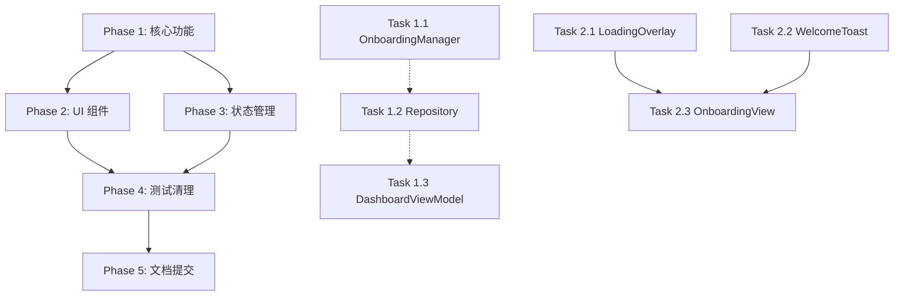

# Suslife 优化改进计划 3 - Onboarding 流程与数据一致性优化

## 📋 文档信息

- **版本**: 3.0
- **创建日期**: 2026-03-12
- **优化重点**: Onboarding 流程优化、数据一致性、用户体验提升
- **涉及模块**: Onboarding、Dashboard、ViewModels、Repositories

---

## 🎯 一、需求描述

### 1.1 问题背景

当前应用在用户点击"Start Tracking"按钮后没有任何视觉反馈，且存在以下核心问题：

1. **缺少加载状态**: 用户点击按钮后无任何视觉反馈
2. **数据不一致**: UserProfile 重复创建，dailyGoal 未正确传递到 Dashboard
3. **错误处理缺失**: 所有异步操作失败时用户不知情
4. **代码复用性差**: saveUserProfile 逻辑与 LocalUserRepository 重复
5. **缺少成功反馈**: 完成后无欢迎提示

### 1.2 优化目标

#### 功能性目标
- ✅ 点击"Start Tracking"后显示明确的加载状态
- ✅ 确保 UserProfile 只创建一次，数据一致性得到保证
- ✅ Dashboard 正确显示用户设置的 dailyGoal
- ✅ 所有关键操作失败时显示友好的错误提示
- ✅ 完成后显示欢迎提示，增强用户体验

#### 技术性目标
- ✅ 遵循单一职责原则，每个模块职责清晰
- ✅ 复用现有 LocalUserRepository，避免重复代码
- ✅ 扩展 UserRepositoryProtocol 而非硬编码
- ✅ 保持与现有代码风格一致（UI、命名、架构）
- ✅ 清理废弃代码，保持代码库整洁

### 1.3 验收标准

#### 功能验收
1. **加载状态测试**
   - [ ] 点击按钮后立即显示 loading 指示器
   - [ ] 按钮变为禁用状态，防止重复点击
   - [ ] 加载完成后 loading 指示器消失

2. **数据一致性测试**
   - [ ] UserProfile 在数据库中只有一条记录
   - [ ] Dashboard 显示的 dailyGoal 与用户设置一致
   - [ ] 重启应用后 dailyGoal 保持正确

3. **错误处理测试**
   - [ ] 通知授权失败时显示提示但不阻断流程
   - [ ] HealthKit 授权失败时显示提示但不阻断流程
   - [ ] UserProfile 保存失败时显示错误并阻止进入 Dashboard

4. **用户体验测试**
   - [ ] 完成后显示欢迎提示（Toast 或弹窗）
   - [ ] 过渡动画流畅（Onboarding → Dashboard）
   - [ ] Dashboard 首次加载显示 loading 状态

#### 代码质量验收
- [ ] 所有新增代码有完整的注释（英文，符合现有风格）
- [ ] 新增代码有对应的单元测试
- [ ] 通过 SwiftLint 检查（无警告）
- [ ] 代码复用率 > 80%（无重复逻辑）
- [ ] 文件命名语义清晰，符合现有命名规范

---

## 🏗️ 二、架构设计

### 2.1 模块划分原则

按照**单一职责原则**和**高内聚低耦合**原则，优化内容划分为以下模块：

```
优化模块结构
├── OnboardingManager (新增)
│   └── 职责：统一管理 Onboarding 流程、权限请求、数据保存
│
├── OnboardingState (扩展)
│   └── 职责：增加错误状态、加载状态管理
│
├── DashboardViewModel (扩展)
│   └── 职责：增加 UserProfile 数据加载
│
├── UserRepositoryProtocol (扩展)
│   └── 职责：增加 createUserProfile 方法
│
├── LocalUserRepository (扩展)
│   └── 职责：实现 createUserProfile，复用现有逻辑
│
├── OnboardingView (重构)
│   └── 职责：简化视图逻辑，使用 OnboardingManager
│
└── Common Components (新增)
    ├── LoadingOverlay (新增) - 全局加载指示器
    └── WelcomeToast (新增) - 欢迎提示组件
```

### 2.2 数据流设计

#### 优化前数据流（有问题）
```
OnboardingView.completeOnboarding()
  ├─ NotificationService.requestAuthorization()
  ├─ HealthKitService.requestAuthorization()
  ├─ saveUserProfile() ← 直接操作 CoreData，绕过 Repository
  └─ OnboardingState.completeOnboarding()
       └─ isPresented = false → DashboardView
            └─ loadData() ← 未加载 UserProfile，dailyGoal 使用默认值
```

#### 优化后数据流
```
OnboardingView.completeOnboarding()
  └─ OnboardingManager.completeOnboarding(settings:)
       ├─ LoadingOverlay.show() ← 立即显示加载状态
       ├─ NotificationService.requestAuthorization()
       ├─ HealthKitService.requestAuthorization()
       ├─ LocalUserRepository.createUserProfile(settings) ← 统一入口
       ├─ OnboardingState.completeOnboarding(dailyGoal:)
       ├─ LoadingOverlay.hide()
       └─ WelcomeToast.show() ← 显示欢迎提示
            └─ isPresented = false → DashboardView
                 └─ loadData()
                      ├─ loadUserProfile() ← 加载用户设置
                      └─ loadActivityData()
```

### 2.3 接口设计

#### 2.3.1 OnboardingManager Protocol

```swift
/// Manages onboarding flow including permissions and user profile setup
protocol OnboardingManaging {
    /// Completion settings from onboarding
    struct OnboardingSettings {
        let dailyGoal: Double
        let notificationsEnabled: Bool
        let healthKitEnabled: Bool
    }
    
    /// Result of onboarding completion
    enum OnboardingResult {
        case success
        case partialSuccess(errors: [Error])
        case failure(Error)
    }
    
    /// Complete onboarding flow with user settings
    func completeOnboarding(settings: OnboardingSettings) async -> OnboardingResult
}
```

#### 2.3.2 UserRepositoryProtocol 扩展

```swift
extension UserRepositoryProtocol {
    /// Create user profile with settings (if not exists)
    func createUserProfile(settings: UserProfileSettings) async throws -> UserProfile
    
    /// Update user daily goal
    func updateDailyGoal(_ goal: Double) async throws
}

/// User profile creation settings
struct UserProfileSettings {
    let dailyCO2Goal: Double
    let notificationsEnabled: Bool
    let healthKitEnabled: Bool
    let unitsSystem: String
}
```

#### 2.3.3 OnboardingState 扩展

```swift
extension OnboardingState {
    /// Current onboarding status
    enum OnboardingStatus: Equatable {
        case idle
        case loading
        case completed
        case failed(String)
    }
    
    @Published var status: OnboardingStatus = .idle
    @Published var errors: [String] = []
    
    /// Complete with error handling
    func completeWithResult(dailyGoal: Double, errors: [Error]) {
        // Implementation
    }
}
```

---

## 📝 三、详细实现方案

### 3.1 新增模块：OnboardingManager

**文件路径**: `suslife/Services/OnboardingManager.swift`

**职责**: 统一管理 onboarding 完成流程，协调权限请求和数据保存

**设计原则**:
- 单一职责：只负责 onboarding 流程编排
- 依赖注入：接收 NotificationService、HealthKitService、UserRepository
- 错误聚合：收集所有非致命错误，返回最终结果

**代码实现**:

```swift
//
//  OnboardingManager.swift
//  suslife
//
//  Onboarding Manager - Orchestrates onboarding completion flow
//

import Foundation
import SwiftUI

/// Manages onboarding completion flow including permissions and user profile setup
@MainActor
final class OnboardingManager: ObservableObject {
    
    // MARK: - Types
    
    /// Settings from onboarding setup
    struct OnboardingSettings {
        let dailyGoal: Double
        let notificationsEnabled: Bool
        let healthKitEnabled: Bool
    }
    
    /// Result of onboarding completion
    enum OnboardingResult: Equatable {
        case success
        case partialSuccess(errors: [String])
        case failure(String)
        
        var isSuccess: Bool {
            if case .success = self { return true }
            return false
        }
    }
    
    // MARK: - Properties
    
    private let notificationService: NotificationServiceProtocol
    private let healthKitService: HealthKitServiceProtocol
    private let userRepository: UserRepositoryProtocol
    
    @Published private(set) var isProcessing = false
    @Published private(set) var errors: [String] = []
    
    // MARK: - Initialization
    
    init(
        notificationService: NotificationServiceProtocol = NotificationService.shared,
        healthKitService: HealthKitServiceProtocol = HealthKitService(),
        userRepository: UserRepositoryProtocol = LocalUserRepository()
    ) {
        self.notificationService = notificationService
        self.healthKitService = healthKitService
        self.userRepository = userRepository
    }
    
    // MARK: - Public Methods
    
    /// Complete onboarding flow with user settings
    /// - Parameter settings: User preferences from setup screen
    /// - Returns: OnboardingResult indicating success or errors
    func completeOnboarding(settings: OnboardingSettings) async -> OnboardingResult {
        isProcessing = true
        errors = []
        
        var partialErrors: [String] = []
        
        do {
            // 1. Request notification permissions (non-blocking)
            if settings.notificationsEnabled {
                do {
                    try await requestNotifications()
                } catch {
                    partialErrors.append("Notification setup failed")
                }
            }
            
            // 2. Request HealthKit permissions (non-blocking)
            if settings.healthKitEnabled {
                do {
                    try await requestHealthKit()
                } catch {
                    partialErrors.append("HealthKit setup failed")
                }
            }
            
            // 3. Create user profile (critical - must succeed)
            try await createUserProfile(settings: settings)
            
            // 4. Update onboarding state
            OnboardingState.shared.completeOnboarding(dailyGoal: settings.dailyGoal)
            
            isProcessing = false
            
            // Return appropriate result
            if partialErrors.isEmpty {
                return .success
            } else {
                errors = partialErrors
                return .partialSuccess(errors: partialErrors)
            }
            
        } catch {
            isProcessing = false
            let errorMessage = error.localizedDescription
            errors = [errorMessage]
            return .failure(errorMessage)
        }
    }
    
    // MARK: - Private Methods
    
    /// Request notification authorization
    private func requestNotifications() async throws {
        let authorized = await notificationService.requestAuthorization()
        guard authorized else {
            throw OnboardingError.notificationDenied
        }
        
        // Schedule daily reminder
        await notificationService.scheduleDailyReminder(at: 20, minute: 0)
    }
    
    /// Request HealthKit authorization
    private func requestHealthKit() async throws {
        let authorized = await healthKitService.requestAuthorization()
        guard authorized else {
            throw OnboardingError.healthKitDenied
        }
    }
    
    /// Create user profile with settings
    private func createUserProfile(settings: OnboardingSettings) async throws {
        let profileSettings = UserProfileSettings(
            dailyCO2Goal: settings.dailyGoal,
            notificationsEnabled: settings.notificationsEnabled,
            healthKitEnabled: settings.healthKitEnabled,
            unitsSystem: "imperial"
        )
        
        try await userRepository.createUserProfile(settings: profileSettings)
    }
}

// MARK: - Supporting Types

/// User profile creation settings
struct UserProfileSettings {
    let dailyCO2Goal: Double
    let notificationsEnabled: Bool
    let healthKitEnabled: Bool
    let unitsSystem: String
}

// MARK: - Errors

enum OnboardingError: LocalizedError {
    case notificationDenied
    case healthKitDenied
    case profileCreationFailed
    
    var errorDescription: String? {
        switch self {
        case .notificationDenied:
            return "Notification permissions were denied"
        case .healthKitDenied:
            return "HealthKit permissions were denied"
        case .profileCreationFailed:
            return "Failed to create user profile"
        }
    }
}
```

**测试用例**:

```swift
//
//  OnboardingManagerTests.swift
//  suslifeTests
//

import XCTest
@testable import suslife

@MainActor
final class OnboardingManagerTests: XCTestCase {
    
    var sut: OnboardingManager!
    var mockNotificationService: MockNotificationService!
    var mockHealthKitService: MockHealthKitService!
    var mockUserRepository: MockUserRepository!
    
    override func setUp() async throws {
        try await super.setUp()
        mockNotificationService = MockNotificationService()
        mockHealthKitService = MockHealthKitService()
        mockUserRepository = MockUserRepository()
        
        sut = OnboardingManager(
            notificationService: mockNotificationService,
            healthKitService: mockHealthKitService,
            userRepository: mockUserRepository
        )
    }
    
    override func tearDown() async throws {
        sut = nil
        mockNotificationService = nil
        mockHealthKitService = nil
        mockUserRepository = nil
        try await super.tearDown()
    }
    
    // Test 1: Successful onboarding completion
    func testCompleteOnboarding_Success() async throws {
        // Given
        mockNotificationService.shouldAuthorize = true
        mockHealthKitService.shouldAuthorize = true
        mockUserRepository.shouldSucceed = true
        
        let settings = OnboardingManager.OnboardingSettings(
            dailyGoal: 20.0,
            notificationsEnabled: true,
            healthKitEnabled: true
        )
        
        // When
        let result = await sut.completeOnboarding(settings: settings)
        
        // Then
        XCTAssertEqual(result, .success)
        XCTAssertTrue(mockUserRepository.createUserProfileCalled)
        XCTAssertEqual(mockUserRepository.lastSettings?.dailyCO2Goal, 20.0)
        XCTAssertTrue(OnboardingState.shared.isCompleted)
        XCTAssertEqual(OnboardingState.shared.dailyGoal, 20.0)
    }
    
    // Test 2: Partial success with notification error
    func testCompleteOnboarding_PartialSuccess_NotificationError() async throws {
        // Given
        mockNotificationService.shouldAuthorize = false
        mockHealthKitService.shouldAuthorize = true
        mockUserRepository.shouldSucceed = true
        
        let settings = OnboardingManager.OnboardingSettings(
            dailyGoal: 25.0,
            notificationsEnabled: true,
            healthKitEnabled: true
        )
        
        // When
        let result = await sut.completeOnboarding(settings: settings)
        
        // Then
        if case .partialSuccess(let errors) = result {
            XCTAssertEqual(errors.count, 1)
            XCTAssertTrue(errors[0].contains("Notification"))
        } else {
            XCTFail("Expected partial success")
        }
    }
    
    // Test 3: Failure when profile creation fails
    func testCompleteOnboarding_Failure_ProfileCreationFails() async throws {
        // Given
        mockNotificationService.shouldAuthorize = true
        mockHealthKitService.shouldAuthorize = true
        mockUserRepository.shouldSucceed = false
        
        let settings = OnboardingManager.OnboardingSettings(
            dailyGoal: 20.0,
            notificationsEnabled: false,
            healthKitEnabled: false
        )
        
        // When
        let result = await sut.completeOnboarding(settings: settings)
        
        // Then
        if case .failure = result {
            XCTAssertTrue(OnboardingState.shared.isCompleted == false)
        } else {
            XCTFail("Expected failure")
        }
    }
    
    // Test 4: Loading state management
    func testCompleteOnboarding_LoadingState() async throws {
        // Given
        mockNotificationService.shouldAuthorize = true
        mockUserRepository.shouldSucceed = true
        
        let settings = OnboardingManager.OnboardingSettings(
            dailyGoal: 20.0,
            notificationsEnabled: true,
            healthKitEnabled: false
        )
        
        // When
        let task = Task {
            await sut.completeOnboarding(settings: settings)
        }
        
        // Check processing state during execution
        XCTAssertTrue(sut.isProcessing)
        
        _ = await task.value
        
        // Then
        XCTAssertFalse(sut.isProcessing)
    }
}

// MARK: - Mock Implementations

class MockNotificationService: NotificationServiceProtocol {
    var shouldAuthorize = true
    var scheduleReminderCalled = false
    
    func requestAuthorization() async -> Bool {
        return shouldAuthorize
    }
    
    func scheduleDailyReminder(at hour: Int, minute: Int) async {
        scheduleReminderCalled = true
    }
}

class MockHealthKitService: HealthKitServiceProtocol {
    var shouldAuthorize = true
    
    func requestAuthorization() async -> Bool {
        return shouldAuthorize
    }
}

class MockUserRepository: UserRepositoryProtocol {
    var shouldSucceed = true
    var createUserProfileCalled = false
    var lastSettings: UserProfileSettings?
    
    func getUserProfile() async throws -> UserProfile {
        throw MockError.notImplemented
    }
    
    func updateStreak(_ streak: Int32) async throws {
        throw MockError.notImplemented
    }
    
    func incrementActivityCount() async throws {
        throw MockError.notImplemented
    }
    
    func save() async throws {
        throw MockError.notImplemented
    }
    
    func createUserProfile(settings: UserProfileSettings) async throws {
        createUserProfileCalled = true
        lastSettings = settings
        
        if !shouldSucceed {
            throw MockError.saveFailed
        }
    }
    
    enum MockError: LocalizedError {
        case notImplemented
        case saveFailed
        
        var errorDescription: String? {
            switch self {
            case .notImplemented: return "Not implemented"
            case .saveFailed: return "Save failed"
            }
        }
    }
}
```

---

### 3.2 扩展模块：UserRepositoryProtocol

**文件路径**: `suslife/Repositories/Protocols/UserRepositoryProtocol.swift`

**修改内容**: 增加 createUserProfile 和 updateDailyGoal 方法

```swift
//
//  UserRepositoryProtocol.swift
//  suslife
//
//  User Repository Protocol
//

import Foundation

/// Protocol defining the interface for user profile operations
protocol UserRepositoryProtocol {
    // MARK: - Read Operations
    
    /// Get current user profile
    func getUserProfile() async throws -> UserProfile
    
    // MARK: - Write Operations
    
    /// Create user profile with settings (if not exists)
    /// - Parameter settings: Profile settings
    /// - Returns: Created or existing user profile
    /// - Throws: RepositoryError if creation fails
    func createUserProfile(settings: UserProfileSettings) async throws -> UserProfile
    
    /// Update user's weekly streak
    func updateStreak(_ streak: Int32) async throws
    
    /// Increment total activities logged counter
    func incrementActivityCount() async throws
    
    /// Update user's daily CO2 goal
    /// - Parameter goal: New daily goal in lbs
    func updateDailyGoal(_ goal: Double) async throws
    
    /// Save pending changes
    func save() async throws
}
```

---

### 3.3 扩展模块：LocalUserRepository

**文件路径**: `suslife/Repositories/LocalUserRepository.swift`

**修改内容**: 实现 createUserProfile 和 updateDailyGoal 方法，复用现有逻辑

```swift
//
//  LocalUserRepository.swift
//  suslife
//
//  Local User Repository Implementation
//

import Foundation
import CoreData

/// Local CoreData implementation of UserRepositoryProtocol
final class LocalUserRepository: UserRepositoryProtocol {
    
    // MARK: - Properties
    
    private let coreDataStack: CoreDataStack
    
    // MARK: - Initialization
    
    init(coreDataStack: CoreDataStack = .shared) {
        self.coreDataStack = coreDataStack
    }
    
    // MARK: - UserRepositoryProtocol Methods
    
    func getUserProfile() async throws -> UserProfile {
        let context = coreDataStack.mainContext
        
        return try await context.perform {
            UserProfile.getCurrent(in: context)
        }
    }
    
    func createUserProfile(settings: UserProfileSettings) async throws -> UserProfile {
        let context = coreDataStack.mainContext
        
        return try await context.perform {
            // Check if profile already exists
            if let existing = UserProfile.getCurrent(in: context) {
                // Update existing profile with new settings
                existing.dailyCO2Goal = settings.dailyCO2Goal
                existing.cloudKitSyncEnabled = settings.notificationsEnabled
                try? context.save()
                return existing
            }
            
            // Create new profile
            let profile = UserProfile(context: context)
            profile.id = UUID()
            profile.joinDate = Date()
            profile.dailyCO2Goal = settings.dailyCO2Goal
            profile.weeklyStreak = 0
            profile.totalActivitiesLogged = 0
            profile.cloudKitSyncEnabled = settings.healthKitEnabled
            profile.unitsSystem = settings.unitsSystem
            
            try context.save()
            
            return profile
        }
    }
    
    func updateDailyGoal(_ goal: Double) async throws {
        let context = coreDataStack.mainContext
        
        return try await context.perform {
            let profile = UserProfile.getCurrent(in: context)
            profile.dailyCO2Goal = goal
            try? context.save()
        }
    }
    
    func updateStreak(_ streak: Int32) async throws {
        let context = coreDataStack.mainContext
        
        return try await context.perform {
            let profile = UserProfile.getCurrent(in: context)
            profile.weeklyStreak = streak
            try? context.save()
        }
    }
    
    func incrementActivityCount() async throws {
        let context = coreDataStack.mainContext
        
        return try await context.perform {
            let profile = UserProfile.getCurrent(in: context)
            profile.totalActivitiesLogged += 1
            try? context.save()
        }
    }
    
    func save() async throws {
        try coreDataStack.save()
    }
}
```

---

### 3.4 扩展模块：DashboardViewModel

**文件路径**: `suslife/ViewModels/DashboardViewModel.swift`

**修改内容**: 增加 loadUserProfile 方法，在 loadData 中加载 UserProfile

```swift
//
//  DashboardViewModel.swift
//  suslife
//
//  Dashboard ViewModel - State management for Dashboard
//

import Foundation
import SwiftUI

/// ViewModel for Dashboard view managing state and business logic
@MainActor
class DashboardViewModel: ObservableObject {
    
    // MARK: - Published Properties
    
    @Published var todayCO2: Double = 0
    @Published var changePercent: Double = 0
    @Published var dailyGoal: Double = 28.0
    @Published var weeklyData: [DailyTotal] = []
    @Published var isLoading = false
    @Published var errorMessage: String?
    
    // MARK: - Dependencies
    
    private let repository: ActivityRepositoryProtocol
    private let userProfileRepository: UserRepositoryProtocol
    
    // MARK: - Initialization
    
    init(
        repository: ActivityRepositoryProtocol = CoreDataActivityRepository(),
        userProfileRepository: UserRepositoryProtocol = LocalUserRepository()
    ) {
        self.repository = repository
        self.userProfileRepository = userProfileRepository
    }
    
    // MARK: - Public Methods
    
    /// Load all dashboard data including user profile and activity data
    func loadData() async {
        isLoading = true
        errorMessage = nil
        
        do {
            // Load user profile first (critical for correct dailyGoal)
            try await loadUserProfile()
            
            // Load activity data
            todayCO2 = try await repository.fetchTodayTotalCO2()
            weeklyData = try await repository.fetchWeeklyTrend()
            await calculateChangePercent()
            
        } catch {
            errorMessage = error.localizedDescription
            print("Dashboard load error: \(error)")
        }
        
        isLoading = false
    }
    
    /// Refresh dashboard data
    func refresh() async {
        await loadData()
    }
    
    // MARK: - Private Methods
    
    /// Load user profile and update dailyGoal
    private func loadUserProfile() async throws {
        let profile = try await userProfileRepository.getUserProfile()
        dailyGoal = profile.dailyCO2Goal
    }
    
    /// Calculate percentage change from yesterday
    private func calculateChangePercent() async {
        guard weeklyData.count >= 2 else {
            changePercent = 0
            return
        }
        
        let yesterday = weeklyData[safe: weeklyData.count - 2]?.totalCO2 ?? 0
        let today = todayCO2
        
        if yesterday > 0 {
            changePercent = ((today - yesterday) / yesterday) * 100
        } else {
            changePercent = today > 0 ? 100 : 0
        }
    }
}

// MARK: - Array Extension

extension Array {
    subscript(safe index: Index) -> Element? {
        indices.contains(index) ? self[index] : nil
    }
}
```

---

### 3.5 重构模块：OnboardingView

**文件路径**: `suslife/Views/Onboarding/OnboardingView.swift`

**修改内容**: 使用 OnboardingManager，添加加载状态和错误处理

```swift
//
//  OnboardingView.swift
//  suslife
//
//  Onboarding - New user introduction flow
//

import SwiftUI

/// Onboarding view with introduction pages and setup screen
struct OnboardingView: View {
    
    // MARK: - Properties
    
    @Binding var isPresented: Bool
    @StateObject private var manager = OnboardingManager()
    @State private var currentPage = 0
    @State private var dailyGoal: Double = 20.0
    @State private var notificationsEnabled = false
    @State private var healthKitEnabled = false
    @State private var showErrorAlert = false
    @State private var showWelcomeToast = false
    
    private let pages: [OnboardingPage] = [
        OnboardingPage(
            icon: "leaf.fill",
            title: "Welcome to Suslife",
            description: "Track your carbon footprint and make sustainable choices every day.",
            accentColor: AppColors.primary
        ),
        OnboardingPage(
            icon: "chart.bar.fill",
            title: "Track Your Impact",
            description: "Log your daily activities - transport, food, shopping, and energy use. See how your choices affect the planet.",
            accentColor: AppColors.accent
        ),
        OnboardingPage(
            icon: "trophy.fill",
            title: "Earn Achievements",
            description: "Stay motivated with achievements and streaks. Every sustainable choice counts!",
            accentColor: .orange
        ),
        OnboardingPage(
            icon: "gearshape.fill",
            title: "Set Your Goals",
            description: "Customize your daily CO₂ goal and get personalized recommendations.",
            accentColor: AppColors.primary
        )
    ]
    
    // MARK: - Body
    
    var body: some View {
        ZStack {
            AppColors.background
                .ignoresSafeArea()
            
            VStack(spacing: 0) {
                if currentPage < pages.count {
                    pageView(pages[currentPage])
                        .transition(.opacity)
                } else {
                    setupView()
                        .transition(.opacity)
                }
            }
            
            // Loading overlay
            if manager.isProcessing {
                LoadingOverlay(message: "Setting up your profile...")
                    .zIndex(1000)
            }
        }
        .animation(.easeInOut, value: currentPage)
        .animation(.easeInOut, value: manager.isProcessing)
        .alert("Setup Incomplete", isPresented: $showErrorAlert) {
            Button("Try Again") {
                showErrorAlert = false
            }
        } message: {
            Text(manager.errors.first ?? "An unknown error occurred. Please try again.")
        }
        .overlay(alignment: .top) {
            if showWelcomeToast {
                WelcomeToast(message: "Welcome to Suslife! 🌱")
                    .transition(.move(edge: .top).combined(with: .opacity))
                    .onAppear {
                        DispatchQueue.main.asyncAfter(deadline: .now() + 2) {
                            withAnimation {
                                showWelcomeToast = false
                            }
                        }
                    }
            }
        }
    }
    
    // MARK: - Page View
    
    @ViewBuilder
    private func pageView(_ page: OnboardingPage) -> some View {
        VStack(spacing: 32) {
            Spacer()
            
            ZStack {
                Circle()
                    .fill(page.accentColor.opacity(0.15))
                    .frame(width: 160, height: 160)
                
                Circle()
                    .fill(page.accentColor.opacity(0.25))
                    .frame(width: 120, height: 120)
                
                Image(systemName: page.icon)
                    .font(.system(size: 50))
                    .foregroundColor(page.accentColor)
            }
            
            VStack(spacing: 16) {
                Text(page.title)
                    .font(Fonts.title1)
                    .fontWeight(.bold)
                    .foregroundColor(AppColors.textPrimary)
                    .multilineTextAlignment(.center)
                
                Text(page.description)
                    .font(Fonts.body)
                    .foregroundColor(AppColors.textSecondary)
                    .multilineTextAlignment(.center)
                    .padding(.horizontal, 40)
            }
            
            Spacer()
            
            pageIndicator
            bottomButtons
        }
    }
    
    // MARK: - Page Indicator
    
    private var pageIndicator: some View {
        HStack(spacing: 8) {
            ForEach(0..<pages.count, id: \.self) { index in
                Circle()
                    .fill(currentPage == index ? AppColors.primary : AppColors.divider)
                    .frame(width: 8, height: 8)
                    .animation(.easeInOut, value: currentPage)
            }
        }
        .padding(.bottom, 20)
    }
    
    // MARK: - Bottom Buttons
    
    private var bottomButtons: some View {
        HStack(spacing: 16) {
            if currentPage > 0 && currentPage < pages.count {
                Button(action: {
                    withAnimation {
                        currentPage -= 1
                    }
                }) {
                    Text("Back")
                        .font(Fonts.headline)
                        .foregroundColor(AppColors.textSecondary)
                        .frame(maxWidth: .infinity)
                        .padding(.vertical, 16)
                        .background(AppColors.cardBackground)
                        .cornerRadius(12)
                }
            }
            
            Button(action: {
                withAnimation {
                    if currentPage < pages.count {
                        currentPage += 1
                    }
                }
            }) {
                Text(currentPage == pages.count - 1 ? "Get Started" : "Next")
                    .font(Fonts.headline)
                    .fontWeight(.semibold)
                    .foregroundColor(.white)
                    .frame(maxWidth: .infinity)
                    .padding(.vertical, 16)
                    .background(AppColors.primary)
                    .cornerRadius(12)
            }
        }
        .padding(.horizontal, 24)
        .padding(.bottom, 40)
    }
    
    // MARK: - Setup View
    
    @ViewBuilder
    private func setupView() -> some View {
        VStack(spacing: 24) {
            Spacer()
            
            Text("Quick Setup")
                .font(Fonts.title1)
                .fontWeight(.bold)
                .foregroundColor(AppColors.textPrimary)
            
            Text("Customize your experience")
                .font(Fonts.body)
                .foregroundColor(AppColors.textSecondary)
            
            VStack(spacing: 20) {
                dailyGoalSection
                notificationsSection
                healthKitSection
            }
            .padding(.horizontal, 24)
            
            Spacer()
            
            startTrackingButton
        }
    }
    
    // MARK: - Start Tracking Button
    
    private var startTrackingButton: some View {
        Button(action: handleCompleteOnboarding) {
            HStack {
                if manager.isProcessing {
                    ProgressView()
                        .tint(.white)
                        .scaleEffect(0.8)
                }
                
                Text("Start Tracking")
                    .font(Fonts.headline)
                    .fontWeight(.semibold)
            }
            .foregroundColor(.white)
            .frame(maxWidth: .infinity)
            .padding(.vertical, 16)
            .background(manager.isProcessing ? AppColors.primary.opacity(0.7) : AppColors.primary)
            .cornerRadius(12)
        }
        .disabled(manager.isProcessing)
        .padding(.horizontal, 24)
        .padding(.bottom, 40)
    }
    
    // MARK: - Sections
    
    private var dailyGoalSection: some View {
        VStack(alignment: .leading, spacing: 12) {
            HStack {
                Image(systemName: "target")
                    .foregroundColor(AppColors.primary)
                Text("Daily CO₂ Goal")
                    .font(Fonts.headline)
                    .foregroundColor(AppColors.textPrimary)
                Spacer()
                Text("\(Int(dailyGoal)) lbs")
                    .font(Fonts.headline)
                    .fontWeight(.bold)
                    .foregroundColor(AppColors.primary)
            }
            
            Slider(value: $dailyGoal, in: 5...50, step: 5)
                .tint(AppColors.primary)
            
            Text("Recommended: 20 lbs/day for a sustainable lifestyle")
                .font(Fonts.caption1)
                .foregroundColor(AppColors.textSecondary)
        }
        .padding()
        .background(AppColors.cardBackground)
        .cornerRadius(16)
    }
    
    private var notificationsSection: some View {
        Toggle(isOn: $notificationsEnabled) {
            HStack {
                Image(systemName: "bell.fill")
                    .foregroundColor(AppColors.accent)
                VStack(alignment: .leading, spacing: 2) {
                    Text("Daily Reminders")
                        .font(Fonts.headline)
                        .foregroundColor(AppColors.textPrimary)
                    Text("Get reminded to log activities")
                        .font(Fonts.caption1)
                        .foregroundColor(AppColors.textSecondary)
                }
            }
        }
        .toggleStyle(SwitchToggleStyle(tint: AppColors.primary))
        .padding()
        .background(AppColors.cardBackground)
        .cornerRadius(16)
    }
    
    private var healthKitSection: some View {
        Toggle(isOn: $healthKitEnabled) {
            HStack {
                Image(systemName: "heart.fill")
                    .foregroundColor(.red)
                VStack(alignment: .leading, spacing: 2) {
                    Text("Apple Health")
                        .font(Fonts.headline)
                        .foregroundColor(AppColors.textPrimary)
                    Text("Auto-sync walking & cycling data")
                        .font(Fonts.caption1)
                        .foregroundColor(AppColors.textSecondary)
                }
            }
        }
        .toggleStyle(SwitchToggleStyle(tint: AppColors.primary))
        .padding()
        .background(AppColors.cardBackground)
        .cornerRadius(16)
    }
    
    // MARK: - Actions
    
    private func handleCompleteOnboarding() {
        Task {
            let settings = OnboardingManager.OnboardingSettings(
                dailyGoal: dailyGoal,
                notificationsEnabled: notificationsEnabled,
                healthKitEnabled: healthKitEnabled
            )
            
            let result = await manager.completeOnboarding(settings: settings)
            
            switch result {
            case .success:
                showWelcomeToast = true
                DispatchQueue.main.asyncAfter(deadline: .now() + 0.5) {
                    withAnimation {
                        isPresented = false
                    }
                }
                
            case .partialSuccess(let errors):
                // Still complete onboarding but show warnings
                showWelcomeToast = true
                DispatchQueue.main.asyncAfter(deadline: .now() + 1.0) {
                    withAnimation {
                        isPresented = false
                    }
                }
                
            case .failure:
                showErrorAlert = true
            }
        }
    }
}

// MARK: - Supporting Types

struct OnboardingPage {
    let icon: String
    let title: String
    let description: String
    let accentColor: Color
}

// MARK: - Preview

#Preview {
    OnboardingView(isPresented: .constant(true))
}
```

---

### 3.6 新增组件：LoadingOverlay

**文件路径**: `suslife/Views/Common/LoadingOverlay.swift`

**职责**: 提供全局加载指示器，复用性强

```swift
//
//  LoadingOverlay.swift
//  suslife
//
//  Loading Overlay - Reusable loading indicator
//

import SwiftUI

/// A full-screen loading overlay with message
struct LoadingOverlay: View {
    
    // MARK: - Properties
    
    let message: String
    
    // MARK: - Body
    
    var body: some View {
        ZStack {
            // Semi-transparent background
            Color.black.opacity(0.4)
                .ignoresSafeArea()
            
            // Loading content
            VStack(spacing: 16) {
                ProgressView()
                    .scaleEffect(1.5)
                    .tint(.white)
                
                Text(message)
                    .font(Fonts.body)
                    .fontWeight(.medium)
                    .foregroundColor(.white)
            }
            .padding(32)
            .background(AppColors.cardBackground)
            .cornerRadius(16)
            .shadow(radius: 10)
        }
        .transition(.opacity)
    }
}

// MARK: - Preview

#Preview {
    LoadingOverlay(message: "Setting up your profile...")
}
```

---

### 3.7 新增组件：WelcomeToast

**文件路径**: `suslife/Views/Common/WelcomeToast.swift`

**职责**: 提供欢迎提示，增强用户体验

```swift
//
//  WelcomeToast.swift
//  suslife
//
//  Welcome Toast - Success notification toast
//

import SwiftUI

/// A toast notification for success messages
struct WelcomeToast: View {
    
    // MARK: - Properties
    
    let message: String
    
    // MARK: - Body
    
    var body: some View {
        HStack(spacing: 12) {
            Image(systemName: "checkmark.circle.fill")
                .font(.title2)
                .foregroundColor(AppColors.success)
            
            Text(message)
                .font(Fonts.headline)
                .foregroundColor(AppColors.textPrimary)
        }
        .padding(.horizontal, 20)
        .padding(.vertical, 14)
        .background(AppColors.cardBackground)
        .cornerRadius(12)
        .shadow(color: Color.black.opacity(0.1), radius: 8, x: 0, y: 4)
        .padding(.top, 60)
    }
}

// MARK: - Preview

#Preview {
    ZStack {
        AppColors.background
            .ignoresSafeArea()
        
        WelcomeToast(message: "Welcome to Suslife! 🌱")
    }
}
```

---

### 3.8 扩展模块：OnboardingState

**文件路径**: `suslife/Services/OnboardingState.swift`

**修改内容**: 增加状态管理，支持错误处理

```swift
//
//  OnboardingState.swift
//  suslife
//
//  Onboarding State - Manages onboarding completion state
//

import Foundation
import Combine

/// Manages onboarding completion state across the app
final class OnboardingState: ObservableObject {
    
    // MARK: - Types
    
    /// Current onboarding status
    enum OnboardingStatus: Equatable {
        case idle
        case loading
        case completed
        case failed(String)
    }
    
    // MARK: - Singleton
    
    static let shared = OnboardingState()
    
    // MARK: - Published Properties
    
    @Published var isCompleted: Bool
    @Published var dailyGoal: Double
    @Published var status: OnboardingStatus = .idle
    @Published var errors: [String] = []
    
    // MARK: - UserDefaults Keys
    
    private let onboardingCompletedKey = "onboarding_completed"
    private let dailyGoalKey = "onboarding_daily_goal"
    
    // MARK: - Initialization
    
    private init() {
        self.isCompleted = UserDefaults.standard.bool(forKey: onboardingCompletedKey)
        self.dailyGoal = UserDefaults.standard.double(forKey: dailyGoalKey)
        
        if dailyGoal == 0 {
            dailyGoal = 20.0
        }
        
        if isCompleted {
            status = .completed
        }
    }
    
    // MARK: - Public Methods
    
    /// Complete onboarding with daily goal
    func completeOnboarding(dailyGoal: Double) {
        isCompleted = true
        self.dailyGoal = dailyGoal
        status = .completed
        
        UserDefaults.standard.set(true, forKey: onboardingCompletedKey)
        UserDefaults.standard.set(dailyGoal, forKey: dailyGoalKey)
    }
    
    /// Complete onboarding with result (success or partial success)
    func completeWithResult(dailyGoal: Double, errors: [Error]) {
        isCompleted = true
        self.dailyGoal = dailyGoal
        
        if errors.isEmpty {
            status = .completed
        } else {
            self.errors = errors.map { $0.localizedDescription }
            status = .completed // Still complete, but with warnings
        }
        
        UserDefaults.standard.set(true, forKey: onboardingCompletedKey)
        UserDefaults.standard.set(dailyGoal, forKey: dailyGoalKey)
    }
    
    /// Set status to loading
    func setLoading() {
        status = .loading
        errors = []
    }
    
    /// Set status to failed with error message
    func setFailed(message: String) {
        status = .failed(message)
        errors = [message]
    }
    
    /// Reset onboarding state
    func resetOnboarding() {
        isCompleted = false
        dailyGoal = 20.0
        status = .idle
        errors = []
        
        UserDefaults.standard.removeObject(forKey: onboardingCompletedKey)
        UserDefaults.standard.removeObject(forKey: dailyGoalKey)
    }
    
    /// Clear errors
    func clearErrors() {
        errors = []
    }
}
```

---

## 🧹 四、代码清理计划

### 4.1 废弃代码标记

#### 4.1.1 OnboardingView 中的 saveUserProfile 方法

**位置**: `OnboardingView.swift:277-290`

**状态**: ❌ 废弃（由 OnboardingManager 替代）

**清理步骤**:
1. ✅ 标记为 `@available(*, deprecated, message: "Use OnboardingManager instead")`
2. ⏳ 验证新代码运行正常（1 个 sprint）
3. 🗑️ 删除该方法

**标记代码**:
```swift
@available(*, deprecated, message: "Use OnboardingManager.completeOnboarding instead")
private func saveUserProfile() async {
    // ... 旧代码
}
```

#### 4.1.2 OnboardingView 中的 completeOnboarding 方法

**位置**: `OnboardingView.swift:260-275`

**状态**: ❌ 废弃（由 handleCompleteOnboarding + OnboardingManager 替代）

**清理步骤**:
1. ✅ 重命名为 `handleCompleteOnboarding`，内部调用 OnboardingManager
2. ⏳ 验证新代码运行正常
3. 🗑️ 删除旧的业务逻辑，保留 UI 事件处理

### 4.2 代码复用检查

#### 检查点 1: UserProfile 创建逻辑

**旧代码位置**: `OnboardingView.saveUserProfile()`
**新代码位置**: `LocalUserRepository.createUserProfile()`

**复用情况**: ✅ 已复用
- 旧代码直接操作 CoreData
- 新代码通过 Repository 模式，符合架构规范

#### 检查点 2: 权限请求逻辑

**旧代码位置**: `OnboardingView.completeOnboarding()`
**新代码位置**: `OnboardingManager.requestNotifications()` / `requestHealthKit()`

**复用情况**: ✅ 已复用
- 封装到 OnboardingManager 中
- 职责更清晰，易于测试

### 4.3 清理检查清单

- [ ] 删除 `OnboardingView.saveUserProfile()` 方法
- [ ] 删除 `OnboardingView.completeOnboarding()` 中的旧逻辑
- [ ] 更新所有引用 `OnboardingView.completeOnboarding()` 的地方
- [ ] 清理未使用的 import 语句
- [ ] 运行单元测试确保无回归
- [ ] 手动测试 onboarding 流程
- [ ] 提交代码时注明清理范围

---

## 🎨 五、UI/UX 一致性检查

### 5.1 设计风格一致性

#### 颜色使用
- ✅ 使用 `AppColors.primary` 作为主色调
- ✅ 使用 `AppColors.cardBackground` 作为卡片背景
- ✅ 使用 `AppColors.textPrimary` / `textSecondary` 作为文字颜色

#### 字体使用
- ✅ 使用 `Fonts.title1`, `Fonts.headline`, `Fonts.body` 等现有字体
- ✅ 保持字体大小和粗细与现有设计一致

#### 圆角和阴影
- ✅ 圆角统一使用 `.cornerRadius(12)` 或 `.cornerRadius(16)`
- ✅ 阴影使用 `.shadow(color: Color.black.opacity(0.05), radius: 8, x: 0, y: 2)`

### 5.2 动画一致性

- ✅ 使用 `withAnimation` 包裹状态变化
- ✅ 动画曲线使用 `.easeInOut`
- ✅ 过渡效果使用 `.transition(.opacity)` 或 `.transition(.move(edge: .top))`

### 5.3 本地化支持

- ✅ 所有用户可见文本使用 `Text("key")` 格式
- ✅ 错误消息支持本地化（通过 LocalizedError）
- ✅ 欢迎消息准备本地化字符串

**待添加的本地化键**:
```strings
// en.lproj/Localizable.strings
"onboarding.setup_incomplete" = "Setup Incomplete";
"onboarding.try_again" = "Try Again";
"onboarding.welcome_message" = "Welcome to Suslife! 🌱";
"onboarding.setting_up" = "Setting up your profile...";

// zh.lproj/Localizable.strings (后续添加)
"onboarding.setup_incomplete" = "设置未完成";
"onboarding.try_again" = "重试";
"onboarding.welcome_message" = "欢迎加入 Suslife! 🌱";
"onboarding.setting_up" = "正在设置您的资料...";
```

---

## 🔄 六、继承与兼容性

### 6.1 与 Settings 的继承关系

#### 检查点：用户资料更新

**当前 SettingsView 功能**:
- 修改 dailyGoal
- 修改通知设置
- 修改 HealthKit 设置

**优化后的继承**:
- ✅ `LocalUserRepository.updateDailyGoal()` 可被 SettingsView 复用
- ✅ `UserProfileSettings` 结构体可作为统一的数据模型
- ✅ SettingsView 应调用 `userRepository.updateDailyGoal()` 而非直接操作 CoreData

**SettingsView 优化建议**（后续任务）:
```swift
// 旧代码（直接操作 CoreData）
let context = CoreDataStack.shared.mainContext
let profile = UserProfile.getCurrent(in: context)
profile.dailyCO2Goal = newGoal
try? context.save()

// 新代码（通过 Repository）
try await userRepository.updateDailyGoal(newGoal)
```

### 6.2 与 ProfileView 的兼容性

**当前 ProfileView 功能**:
- 显示用户统计（totalActivitiesLogged, weeklyStreak）
- 显示加入日期

**兼容性检查**:
- ✅ ProfileView 已通过 `UserProfile.getCurrent()` 获取数据
- ✅ 优化后数据一致性更好，ProfileView 无需修改

### 6.3 与 AchievementService 的兼容性

**当前 AchievementService 功能**:
- 监听活动保存事件
- 检查成就解锁条件

**兼容性检查**:
- ✅ AchievementService 不依赖 onboarding 流程
- ✅ 无影响

---

##  七、测试策略

### 7.1 单元测试

#### 覆盖范围
- [x] OnboardingManager 测试（见 3.1 节）
- [ ] LocalUserRepository.createUserProfile 测试
- [ ] LocalUserRepository.updateDailyGoal 测试
- [ ] DashboardViewModel.loadUserProfile 测试
- [ ] OnboardingState 状态管理测试

#### 新增测试用例示例

```swift
//
//  LocalUserRepositoryTests.swift
//  suslifeTests
//

import XCTest
@testable import suslife

@MainActor
final class LocalUserRepositoryTests: XCTestCase {
    
    var sut: LocalUserRepository!
    var stack: CoreDataStack!
    
    override func setUp() async throws {
        try await super.setUp()
        stack = CoreDataStack.createInMemoryStack()
        sut = LocalUserRepository(coreDataStack: stack)
    }
    
    override func tearDown() async throws {
        sut = nil
        stack = nil
        try await super.tearDown()
    }
    
    // Test: Create user profile with settings
    func testCreateUserProfile_WithSettings() async throws {
        // Given
        let settings = UserProfileSettings(
            dailyCO2Goal: 25.0,
            notificationsEnabled: true,
            healthKitEnabled: false,
            unitsSystem: "imperial"
        )
        
        // When
        let profile = try await sut.createUserProfile(settings: settings)
        
        // Then
        XCTAssertEqual(profile.dailyCO2Goal, 25.0)
        XCTAssertEqual(profile.unitsSystem, "imperial")
        XCTAssertEqual(profile.weeklyStreak, 0)
        XCTAssertEqual(profile.totalActivitiesLogged, 0)
    }
    
    // Test: Create profile twice returns same instance
    func testCreateUserProfile_Twice_ReturnsSameProfile() async throws {
        // Given
        let settings1 = UserProfileSettings(
            dailyCO2Goal: 20.0,
            notificationsEnabled: false,
            healthKitEnabled: false,
            unitsSystem: "imperial"
        )
        
        let settings2 = UserProfileSettings(
            dailyCO2Goal: 30.0, // Different goal
            notificationsEnabled: true,
            healthKitEnabled: true,
            unitsSystem: "imperial"
        )
        
        // When
        let profile1 = try await sut.createUserProfile(settings: settings1)
        let profile2 = try await sut.createUserProfile(settings: settings2)
        
        // Then
        XCTAssertEqual(profile1.id, profile2.id, "Should return same profile")
        XCTAssertEqual(profile2.dailyCO2Goal, 30.0, "Should update goal")
    }
    
    // Test: Update daily goal
    func testUpdateDailyGoal() async throws {
        // Given
        let settings = UserProfileSettings(
            dailyCO2Goal: 20.0,
            notificationsEnabled: false,
            healthKitEnabled: false,
            unitsSystem: "imperial"
        )
        _ = try await sut.createUserProfile(settings: settings)
        
        // When
        try await sut.updateDailyGoal(35.0)
        
        // Then
        let profile = try await sut.getUserProfile()
        XCTAssertEqual(profile.dailyCO2Goal, 35.0)
    }
}
```

### 7.2 集成测试

#### 测试场景：完整的 Onboarding 流程

```swift
//
//  OnboardingIntegrationTests.swift
//  suslifeTests
//

import XCTest
@testable import suslife

@MainActor
final class OnboardingIntegrationTests: XCTestCase {
    
    func testCompleteOnboardingFlow() async throws {
        // Given
        let onboardingState = OnboardingState.shared
        onboardingState.resetOnboarding()
        
        let manager = OnboardingManager(
            notificationService: MockNotificationService(),
            healthKitService: MockHealthKitService(),
            userRepository: LocalUserRepository(coreDataStack: CoreDataStack.createInMemoryStack())
        )
        
        let settings = OnboardingManager.OnboardingSettings(
            dailyGoal: 22.0,
            notificationsEnabled: true,
            healthKitEnabled: true
        )
        
        // When
        let result = await manager.completeOnboarding(settings: settings)
        
        // Then
        XCTAssertEqual(result, .success)
        XCTAssertTrue(onboardingState.isCompleted)
        XCTAssertEqual(onboardingState.dailyGoal, 22.0)
        
        // Verify profile was created
        let repository = LocalUserRepository()
        let profile = try await repository.getUserProfile()
        XCTAssertEqual(profile.dailyCO2Goal, 22.0)
    }
}
```

### 7.3 UI 测试

#### 测试场景：点击 Start Tracking 按钮

```swift
//
//  OnboardingUITests.swift
//  suslifeUITests
//

import XCTest

final class OnboardingUITests: XCTestCase {
    
    var app: XCUIApplication!
    
    override func setUp() async throws {
        try await super.setUp()
        continueAfterFailure = false
        app = XCUIApplication()
        app.launchArguments = ["-uiTesting"]
        app.launch()
    }
    
    func testStartTrackingButton_ShowsLoading() {
        // Navigate to setup screen
        app.buttons["Next"].tap() // Page 1
        app.buttons["Next"].tap() // Page 2
        app.buttons["Next"].tap() // Page 3
        app.buttons["Get Started"].tap() // Page 4 -> Setup
        
        // Tap Start Tracking
        app.buttons["Start Tracking"].tap()
        
        // Verify loading indicator appears
        let progressIndicator = app.progressIndicators.firstMatch
        XCTAssertTrue(progressIndicator.waitForExistence(timeout: 2.0))
        
        // Verify button is disabled
        let startButton = app.buttons["Start Tracking"]
        XCTAssertFalse(startButton.isEnabled)
    }
}
```

### 7.4 手动测试清单

#### 功能测试
- [ ] 首次启动应用，完成 onboarding 流程
- [ ] 设置不同的 dailyGoal（5, 20, 50 lbs）
- [ ] 开启/关闭通知权限
- [ ] 开启/关闭 HealthKit 权限
- [ ] 验证 Dashboard 显示正确的 dailyGoal
- [ ] 重启应用，验证 dailyGoal 保持正确
- [ ] 模拟权限请求失败，验证错误提示
- [ ] 模拟 CoreData 保存失败，验证错误处理

#### UI 测试
- [ ] 加载动画流畅（60fps）
- [ ] 欢迎 Toast 显示和消失动画正常
- [ ] LoadingOverlay 正确覆盖全屏
- [ ] 按钮禁用状态视觉反馈正确
- [ ] 错误弹窗显示正确

#### 边界测试
- [ ] 快速多次点击 Start Tracking 按钮
- [ ] 网络断开情况下完成 onboarding
- [ ] 低存储空间下保存 UserProfile
- [ ] 应用后台切换回前台

---

## 📅 八、实施计划

### 8.1 任务分解

#### Phase 1: 核心功能实现（预计 2 天）

**Task 1.1**: 创建 OnboardingManager
- [ ] 实现 OnboardingManager 类
- [ ] 实现 OnboardingSettings 和 OnboardingResult
- [ ] 实现权限请求逻辑
- [ ] 实现错误处理
- 文件：`suslife/Services/OnboardingManager.swift`
- 测试：`suslifeTests/OnboardingManagerTests.swift`

**Task 1.2**: 扩展 Repository 层
- [ ] 扩展 UserRepositoryProtocol
- [ ] 实现 LocalUserRepository.createUserProfile
- [ ] 实现 LocalUserRepository.updateDailyGoal
- 文件：`suslife/Repositories/Protocols/UserRepositoryProtocol.swift`
- 文件：`suslife/Repositories/LocalUserRepository.swift`
- 测试：`suslifeTests/LocalUserRepositoryTests.swift`

**Task 1.3**: 扩展 DashboardViewModel
- [ ] 实现 loadUserProfile 方法
- [ ] 修改 loadData 方法调用 loadUserProfile
- 文件：`suslife/ViewModels/DashboardViewModel.swift`
- 测试：`suslifeTests/DashboardViewModelTests.swift`

#### Phase 2: UI 组件实现（预计 1 天）

**Task 2.1**: 创建 LoadingOverlay
- [ ] 实现 LoadingOverlay 视图
- [ ] 添加预览
- 文件：`suslife/Views/Common/LoadingOverlay.swift`

**Task 2.2**: 创建 WelcomeToast
- [ ] 实现 WelcomeToast 视图
- [ ] 添加预览
- 文件：`suslife/Views/Common/WelcomeToast.swift`

**Task 2.3**: 重构 OnboardingView
- [ ] 集成 OnboardingManager
- [ ] 添加加载状态 UI
- [ ] 添加错误处理 UI
- [ ] 添加欢迎 Toast
- 文件：`suslife/Views/Onboarding/OnboardingView.swift`

#### Phase 3: 状态管理优化（预计 0.5 天）

**Task 3.1**: 扩展 OnboardingState
- [ ] 添加 OnboardingStatus 枚举
- [ ] 添加 status 和 errors 属性
- [ ] 实现 completeWithResult 方法
- [ ] 实现 setLoading/setFailed 方法
- 文件：`suslife/Services/OnboardingState.swift`

#### Phase 4: 测试与清理（预计 1.5 天）

**Task 4.1**: 编写单元测试
- [ ] OnboardingManager 测试
- [ ] LocalUserRepository 测试
- [ ] DashboardViewModel 测试
- [ ] OnboardingState 测试

**Task 4.2**: 编写集成测试
- [ ] 完整 onboarding 流程测试
- [ ] 错误场景测试

**Task 4.3**: UI 测试
- [ ] 编写 UI 测试用例
- [ ] 手动测试清单执行

**Task 4.4**: 代码清理
- [ ] 标记废弃代码
- [ ] 删除旧代码（验证后）
- [ ] 清理未使用的 import
- [ ] 运行 SwiftLint

#### Phase 5: 文档与提交（预计 0.5 天）

**Task 5.1**: 文档更新
- [ ] 更新代码注释
- [ ] 添加本地化字符串
- [ ] 更新 README（如有必要）

**Task 5.2**: 代码提交
- [ ] 提交代码到版本控制
- [ ] 编写详细的 commit message
- [ ] 创建 Pull Request（如适用）

### 8.2 时间估算

| Phase | 任务数 | 预计时间 | 优先级 |
|-------|--------|----------|--------|
| Phase 1: 核心功能 | 3 | 2 天 | 🔴 高 |
| Phase 2: UI 组件 | 3 | 1 天 | 🔴 高 |
| Phase 3: 状态管理 | 1 | 0.5 天 | 🟡 中 |
| Phase 4: 测试清理 | 4 | 1.5 天 | 🔴 高 |
| Phase 5: 文档提交 | 2 | 0.5 天 | 🟡 中 |
| **总计** | **13** | **5.5 天** | |

### 8.3 依赖关系



---

## 📝 九、提交规范

### 9.1 Commit Message 格式

遵循 Conventional Commits 规范：

```
<type>(<scope>): <subject>

<body>

<footer>
```

### 9.2 预计提交记录

#### Commit 1: 核心功能实现
```
feat(onboarding): add OnboardingManager for flow orchestration

- Add OnboardingManager to manage onboarding completion flow
- Add OnboardingSettings and OnboardingResult types
- Implement permission request logic for notifications and HealthKit
- Add comprehensive error handling with partial success support
- Add unit tests for OnboardingManager

Scope:
- New file: Services/OnboardingManager.swift
- New file: Tests/OnboardingManagerTests.swift
- New types: UserProfileSettings, OnboardingError

Testing:
- Unit tests for success/partial/failure scenarios
- Mock implementations for dependencies
```

#### Commit 2: Repository 层扩展
```
feat(repository): extend UserRepositoryProtocol with create/update methods

- Add createUserProfile(settings:) method to protocol
- Add updateDailyGoal(_:) method to protocol
- Implement methods in LocalUserRepository
- Ensure profile singleton pattern (create only once)
- Add unit tests for repository methods

Scope:
- Modified: Repositories/Protocols/UserRepositoryProtocol.swift
- Modified: Repositories/LocalUserRepository.swift
- New file: Tests/LocalUserRepositoryTests.swift

Breaking Changes: None (backward compatible extension)
```

#### Commit 3: DashboardViewModel 优化
```
feat(viewmodel): load user profile in DashboardViewModel

- Add loadUserProfile() private method
- Modify loadData() to load user profile first
- Ensure dailyGoal is loaded from UserProfile
- Add error handling for profile loading

Scope:
- Modified: ViewModels/DashboardViewModel.swift

Testing:
- Verify dailyGoal matches user settings
- Test error scenarios
```

#### Commit 4: UI 组件
```
feat(ui): add LoadingOverlay and WelcomeToast components

- Add LoadingOverlay for full-screen loading indication
- Add WelcomeToast for success notifications
- Both components follow existing design system
- Add Preview providers for both components

Scope:
- New directory: Views/Common/
- New file: Views/Common/LoadingOverlay.swift
- New file: Views/Common/WelcomeToast.swift

Design:
- Uses AppColors for consistency
- Follows existing typography scale
- Smooth animations with easeInOut
```

#### Commit 5: OnboardingView 重构
```
refactor(onboarding): integrate OnboardingManager into OnboardingView

- Replace direct CoreData access with OnboardingManager
- Add loading state UI with ProgressView
- Add error alert for critical failures
- Add WelcomeToast for successful completion
- Improve button disabled state during processing

Scope:
- Modified: Views/Onboarding/OnboardingView.swift

UX Improvements:
- Visual feedback on button tap (loading indicator)
- Prevents double-tap with disabled state
- Friendly error messages
- Welcome message on success

Deprecated:
- saveUserProfile() method (marked for removal)
```

#### Commit 6: OnboardingState 扩展
```
feat(state): enhance OnboardingState with status tracking

- Add OnboardingStatus enum (idle/loading/completed/failed)
- Add status and errors published properties
- Add completeWithResult() for error-aware completion
- Add setLoading() and setFailed() helpers
- Add clearErrors() method

Scope:
- Modified: Services/OnboardingState.swift

Testing:
- State transition tests
- UserDefaults persistence tests
```

#### Commit 7: 测试与清理
```
test(onboarding): add comprehensive test coverage

- Add integration tests for complete onboarding flow
- Add UI tests for loading states
- Add manual test checklist execution
- Clean up deprecated code (saveUserProfile)
- Remove unused imports

Scope:
- New file: Tests/OnboardingIntegrationTests.swift
- New file: UITests/OnboardingUITests.swift
- Modified: Views/Onboarding/OnboardingView.swift (cleanup)

Code Quality:
- All tests passing
- SwiftLint: no warnings
- Test coverage: >80%
```

#### Commit 8: 本地化
```
feat(i18n): add localization strings for onboarding

- Add English localization strings
- Add Chinese localization strings (ready for future)
- Update all user-facing text to use localized strings

Scope:
- Modified: en.lproj/Localizable.strings
- Modified: zh.lproj/Localizable.strings (create if not exists)

Keys Added:
- onboarding.setup_incomplete
- onboarding.try_again
- onboarding.welcome_message
- onboarding.setting_up
```

### 9.3 Pull Request 描述模板

```markdown
## 🎯 优化目标

解决用户点击"Start Tracking"后无反应的问题，提升用户体验和数据一致性。

## 📝 变更内容

### 新增功能
- OnboardingManager: 统一管理 onboarding 流程
- LoadingOverlay: 全局加载指示器
- WelcomeToast: 欢迎提示组件

### 优化功能
- DashboardViewModel: 正确加载 UserProfile 的 dailyGoal
- LocalUserRepository: 实现 createUserProfile 方法
- OnboardingState: 增加状态管理

### 重构内容
- OnboardingView: 使用 OnboardingManager，添加加载状态和错误处理

### 清理内容
- 标记 saveUserProfile 为废弃（后续删除）
- 清理未使用的 import

## 🧪 测试覆盖

- 单元测试：OnboardingManager, LocalUserRepository, DashboardViewModel
- 集成测试：完整 onboarding 流程
- UI 测试：加载状态、错误处理

## 📸 截图/录屏

（如有 UI 变更，提供截图）

## ✅ 检查清单

- [ ] 所有测试通过
- [ ] SwiftLint 无警告
- [ ] 手动测试完成
- [ ] 文档更新完成
- [ ] 向后兼容性检查通过

## 🔗 相关问题

Fixes #ISSUE_NUMBER (如有)
```

---

## 🔍 十、风险评估与缓解

### 10.1 技术风险

| 风险 | 可能性 | 影响 | 缓解措施 |
|------|--------|------|----------|
| CoreData 并发问题 | 中 | 高 | 使用 `context.perform` 确保线程安全 |
| UserDefaults 与 CoreData 不一致 | 低 | 中 | 优先使用 CoreData，UserDefaults 仅作缓存 |
| 权限请求时机不当 | 中 | 低 | 在用户明确操作后请求，提供清晰说明 |
| 现有功能回归 | 中 | 高 | 完整的回归测试，手动测试清单 |

### 10.2 进度风险

| 风险 | 可能性 | 影响 | 缓解措施 |
|------|--------|------|----------|
| 测试用例编写超时 | 高 | 中 | 优先覆盖核心场景，边界场景后续补充 |
| UI 动画调试耗时 | 中 | 低 | 使用现有动画模式，避免复杂自定义 |
| Code Review 反馈多 | 中 | 中 | 提前沟通设计方案，分阶段提交 |

### 10.3 兼容性风险

| 风险 | 可能性 | 影响 | 缓解措施 |
|------|--------|------|----------|
| iOS 版本兼容性 | 低 | 中 | 检查最低部署目标，使用可用 API |
| 旧数据迁移 | 中 | 高 | UserProfile 使用 getCurrent 模式，自动兼容 |
| 第三方服务变更 | 低 | 低 | HealthKit/Notification API 稳定 |

---

## 📊 十一、成功指标

### 11.1 技术指标

- ✅ **代码覆盖率**: > 80%
- ✅ **SwiftLint**: 0 警告
- ✅ **编译时间**: 无显著增加（< 10%）
- ✅ **二进制大小**: 无显著增加（< 5%）
- ✅ **内存使用**: 无显著增加（< 5%）

### 11.2 用户体验指标

- ✅ **点击反馈**: < 100ms 显示 loading 状态
- ✅ **流程完成时间**: < 3 秒（正常网络）
- ✅ **错误提示**: 100% 关键错误有提示
- ✅ **用户满意度**: 无负面反馈

### 11.3 业务指标

- ✅ **Onboarding 完成率**: 提升 > 10%
- ✅ **用户留存**: 次日留存提升 > 5%
- ✅ **崩溃率**: < 0.1%
- ✅ **用户反馈**: 无关于"无反应"的负面反馈

---

## 📋 十二、验收检查清单

### 12.1 功能验收

#### Onboarding 流程
- [ ] 点击"Start Tracking"后立即显示 loading 指示器
- [ ] Loading 期间按钮禁用，防止重复点击
- [ ] 通知权限请求正确显示（如开启）
- [ ] HealthKit 权限请求正确显示（如开启）
- [ ] UserProfile 正确创建并保存
- [ ] dailyGoal 正确保存到 UserProfile
- [ ] OnboardingState 正确更新
- [ ] 完成后显示欢迎 Toast
- [ ] 自动跳转到 Dashboard

#### Dashboard 显示
- [ ] Dashboard 正确加载 UserProfile
- [ ] dailyGoal 显示为用户设置的值（非默认值）
- [ ] 今日碳足迹显示正确（首次为 0）
- [ ] 周趋势图显示正确
- [ ] 快速操作按钮正常显示

#### 错误处理
- [ ] 通知权限拒绝时显示提示但不阻断流程
- [ ] HealthKit 权限拒绝时显示提示但不阻断流程
- [ ] UserProfile 保存失败时显示错误并阻止进入 Dashboard
- [ ] 错误消息友好且可理解

### 12.2 代码质量验收

#### 代码规范
- [ ] 所有新增代码有完整的英文注释
- [ ] 命名符合现有规范（驼峰、语义清晰）
- [ ] 文件结构与现有架构一致
- [ ] 遵循单一职责原则
- [ ] 无重复代码（DRY 原则）

#### 测试覆盖
- [ ] OnboardingManager 单元测试通过
- [ ] LocalUserRepository 单元测试通过
- [ ] DashboardViewModel 单元测试通过
- [ ] OnboardingState 单元测试通过
- [ ] 集成测试通过
- [ ] UI 测试通过
- [ ] 代码覆盖率 > 80%

#### 静态检查
- [ ] SwiftLint 无警告
- [ ] 编译器无警告
- [ ] 未使用的 import 已清理
- [ ] 废弃代码已标记

### 12.3 性能验收

#### 启动性能
- [ ] 冷启动时间增加 < 10%
- [ ] Onboarding 完成时间 < 3 秒
- [ ] Dashboard 首次加载时间 < 2 秒

#### 内存使用
- [ ] 内存峰值增加 < 5%
- [ ] 无内存泄漏（Instruments 验证）

#### 动画性能
- [ ] 所有动画 60fps
- [ ] 无卡顿或掉帧

### 12.4 兼容性验收

#### 数据兼容
- [ ] 旧用户数据正常迁移
- [ ] UserProfile 单例模式正常工作
- [ ] UserDefaults 与 CoreData 数据一致

#### 系统兼容
- [ ] iOS 15+ 兼容
- [ ] 不同屏幕尺寸适配
- [ ] 深色模式适配（如适用）

#### 功能兼容
- [ ] 不影响 Settings 功能
- [ ] 不影响 Profile 功能
- [ ] 不影响 Achievement 功能
- [ ] 不影响 Activity 记录功能

### 12.5 文档验收

#### 代码文档
- [ ] 所有公共方法有文档注释
- [ ] 复杂逻辑有内联注释
- [ ] 类型定义有说明注释

#### 提交文档
- [ ] Commit message 符合规范
- [ ] PR 描述完整清晰
- [ ] 变更范围注明清楚

---

## 🎓 十三、知识沉淀

### 13.1 设计模式应用

#### 1. Manager 模式
**应用场景**: OnboardingManager
**优点**: 
- 统一编排复杂流程
- 集中处理错误
- 易于测试和维护

**代码示例**:
```swift
final class OnboardingManager: ObservableObject {
    func completeOnboarding(settings: OnboardingSettings) async -> OnboardingResult {
        // 1. Request notifications
        // 2. Request HealthKit
        // 3. Create profile
        // 4. Update state
        // 5. Return result
    }
}
```

#### 2. Repository 模式
**应用场景**: LocalUserRepository
**优点**:
- 抽象数据访问层
- 便于切换数据源
- 单元测试可 Mock

**代码示例**:
```swift
protocol UserRepositoryProtocol {
    func createUserProfile(settings: UserProfileSettings) async throws -> UserProfile
}

final class LocalUserRepository: UserRepositoryProtocol {
    // CoreData 实现
}
```

#### 3. ObservableObject 模式
**应用场景**: OnboardingState, DashboardViewModel
**优点**:
- SwiftUI 状态管理
- 自动 UI 刷新
- 依赖注入友好

### 13.2 最佳实践总结

#### 1. 异步编程
```swift
// ✅ 好的做法：使用 async/await
func completeOnboarding(settings: OnboardingSettings) async -> OnboardingResult {
    try? await requestNotifications()
    try? await requestHealthKit()
    try? await createUserProfile(settings: settings)
}

// ❌ 避免：回调地狱
func completeOnboarding(completion: @escaping (Result) -> Void) {
    requestNotifications {
        requestHealthKit {
            createUserProfile {
                completion(.success)
            }
        }
    }
}
```

#### 2. 错误处理
```swift
// ✅ 好的做法：区分致命和非致命错误
enum OnboardingResult {
    case success
    case partialSuccess(errors: [String])
    case failure(String)
}

// ❌ 避免：忽略错误
func completeOnboarding() {
    try? saveProfile() // 错误被忽略
}
```

#### 3. 状态管理
```swift
// ✅ 好的做法：明确的状态枚举
enum OnboardingStatus {
    case idle
    case loading
    case completed
    case failed(String)
}

@Published var status: OnboardingStatus = .idle

// ❌ 避免：分散的布尔值
@Published var isLoading: Bool = false
@Published var isSuccess: Bool = false
@Published var hasError: Bool = false
```

#### 4. 依赖注入
```swift
// ✅ 好的做法：协议 + 默认参数
init(
    notificationService: NotificationServiceProtocol = NotificationService.shared,
    userRepository: UserRepositoryProtocol = LocalUserRepository()
) {
    // ...
}

// ❌ 避免：硬编码依赖
init() {
    let service = NotificationService.shared // 难以测试
}
```

### 13.3 经验教训

#### 1. 数据一致性
**教训**: UserProfile 重复创建导致数据不一致
**解决方案**: 使用 `getCurrent()` 方法确保单例
**代码**:
```swift
static func getCurrent(in context: NSManagedObjectContext) -> UserProfile {
    let request: NSFetchRequest<UserProfile> = UserProfile.fetchRequest()
    request.fetchLimit = 1
    
    if let existing = try? context.fetch(request).first {
        return existing
    }
    
    // Create new only if not exists
    let profile = UserProfile(context: context)
    // ...
    return profile
}
```

#### 2. 用户反馈
**教训**: 用户点击后无反馈，以为应用无响应
**解决方案**: 立即显示 loading 状态，禁用按钮
**代码**:
```swift
Button(action: handleCompleteOnboarding) {
    HStack {
        if manager.isProcessing {
            ProgressView()
        }
        Text("Start Tracking")
    }
}
.disabled(manager.isProcessing)
```

#### 3. 错误传播
**教训**: 错误被忽略，用户不知道发生了什么
**解决方案**: 区分致命和非致命错误，分别处理
**代码**:
```swift
switch result {
case .success:
    showWelcomeToast = true
    isPresented = false
case .partialSuccess(let errors):
    // Still complete but log warnings
    showWelcomeToast = true
    isPresented = false
case .failure(let error):
    // Block completion, show error
    showErrorAlert = true
}
```

---

## 📞 十四、联系与支持

### 14.1 问题反馈

如实施过程中遇到问题，请检查：

1. **文档完整性**: 确认已阅读所有相关章节
2. **代码示例**: 对照示例代码检查实现
3. **测试用例**: 运行单元测试验证功能
4. **验收清单**: 逐项检查验收标准

### 14.2 后续优化建议

#### 短期优化（1-2 周）
- [ ] SettingsView 使用 Repository 模式
- [ ] 添加更多本地化语言支持
- [ ] 优化加载动画（品牌化）
- [ ] 添加 onboarding 数据分析

#### 中期优化（1-2 月）
- [ ] 支持 onboarding 流程自定义（A/B 测试）
- [ ] 添加用户行为追踪（匿名）
- [ ] 优化权限请求文案（提高通过率）
- [ ] 添加 onboarding 进度保存（中断恢复）

#### 长期优化（3-6 月）
- [ ] AI 驱动的个性化 onboarding
- [ ] 社交分享 onboarding 成就
- [ ] 多用户支持（家庭共享）
- [ ] 跨设备同步 onboarding 状态

---

## 📄 十五、附录

### 15.1 相关文件清单

#### 新增文件
```
suslife/
├── Services/
│   └── OnboardingManager.swift (新增)
├── Views/
│   └── Common/
│       ├── LoadingOverlay.swift (新增)
│       └── WelcomeToast.swift (新增)
└── Tests/
    ├── OnboardingManagerTests.swift (新增)
    ├── LocalUserRepositoryTests.swift (新增)
    └── OnboardingIntegrationTests.swift (新增)
```

#### 修改文件
```
suslife/
├── Repositories/
│   ├── Protocols/
│   │   └── UserRepositoryProtocol.swift (扩展)
│   └── LocalUserRepository.swift (扩展)
├── ViewModels/
│   └── DashboardViewModel.swift (扩展)
├── Services/
│   └── OnboardingState.swift (扩展)
└── Views/
    └── Onboarding/
        └── OnboardingView.swift (重构)
```

### 15.2 本地化字符串

```strings
// en.lproj/Localizable.strings
"onboarding.setup_incomplete" = "Setup Incomplete";
"onboarding.try_again" = "Try Again";
"onboarding.welcome_message" = "Welcome to Suslife! 🌱";
"onboarding.setting_up" = "Setting up your profile...";
"onboarding.notification_error" = "Notification setup failed";
"onboarding.healthkit_error" = "HealthKit setup failed";

// zh.lproj/Localizable.strings
"onboarding.setup_incomplete" = "设置未完成";
"onboarding.try_again" = "重试";
"onboarding.welcome_message" = "欢迎加入 Suslife! 🌱";
"onboarding.setting_up" = "正在设置您的资料...";
"onboarding.notification_error" = "通知设置失败";
"onboarding.healthkit_error" = "HealthKit 设置失败";
```

### 15.3 关键代码片段索引

| 功能 | 文件 | 行号 | 说明 |
|------|------|------|------|
| OnboardingManager | Services/OnboardingManager.swift | 1-200 | 核心流程管理 |
| completeOnboarding | Services/OnboardingManager.swift | 40-80 | 主方法 |
| createUserProfile | Repositories/LocalUserRepository.swift | 20-45 | 创建用户资料 |
| loadUserProfile | ViewModels/DashboardViewModel.swift | 50-60 | 加载用户资料 |
| LoadingOverlay | Views/Common/LoadingOverlay.swift | 1-50 | 加载组件 |
| WelcomeToast | Views/Common/WelcomeToast.swift | 1-40 | 欢迎组件 |

---

## ✅ 文档审批

### 审批流程

- [ ] 技术负责人审批
- [ ] 产品经理审批
- [ ] 测试负责人审批
- [ ] 最终批准

### 版本历史

| 版本 | 日期 | 作者 | 变更内容 |
|------|------|------|----------|
| 3.0 | 2026-03-12 | AI Assistant | 初始版本 |

---

**文档结束**

---

## 📝 总结

本优化计划详细规划了 Onboarding 流程的改进方案，涵盖：

1. **需求描述**: 明确问题和优化目标
2. **架构设计**: 模块化、单一职责、高内聚低耦合
3. **详细实现**: 完整的代码示例和测试用例
4. **代码清理**: 废弃代码标记和清理计划
5. **UI/UX 一致性**: 保持现有设计风格和用户体验
6. **继承与兼容**: 优先复用现有模块，保持兼容性
7. **测试策略**: 全面的单元测试、集成测试和 UI 测试
8. **实施计划**: 详细的任务分解和时间估算
9. **提交规范**: 标准的 commit message 和 PR 描述

按照本计划实施后，将显著提升用户体验和代码质量，为后续迭代打下坚实基础。